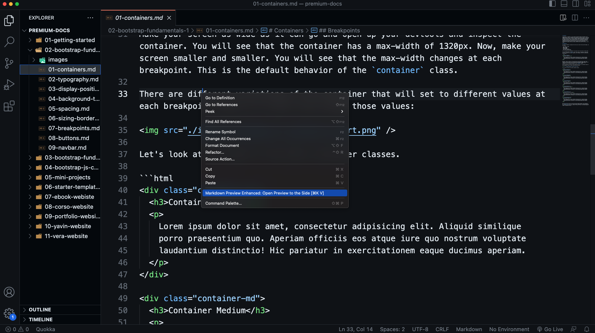
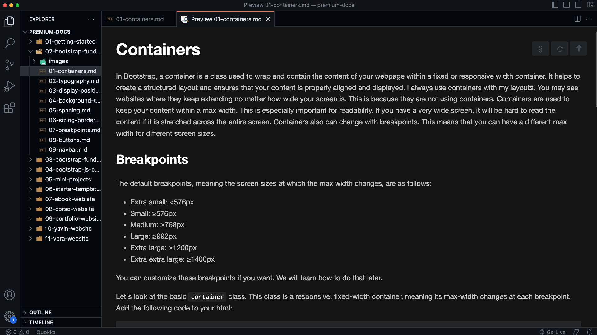

# Premium Docs

Alright, so if you're watching this course at traversymedia.com, that means you get access to the premium documentation for this course. You can download it on this video page, you should see a download link. There is a markdown file for every single video. So you essentially get a written version of the course. This includes all code samples. All of the code will be formatted whether it's HTML, CSS or JavaScript. There are some parts of the course where there is an annoying amount of content to type out. So you can use these to copy and paste that stuff.

## Viewing The Docs

As far as viewing the documentation, there's a ton of different ways to view Markdown files. I use and suggest the `Markdown Preview Enhanced` extension for VS Code. It works really well and you don't have to leave your editor. 

So what I do is open the `premium_docs` folder with VS Code and then on the markdown files, right click and choose 'Markdown Preview Enhanced: Preview To The Side'.

Then you can see the formatted document.

