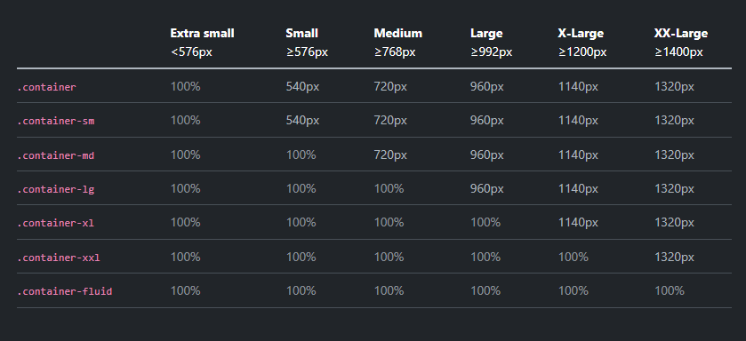

# Containers

In Bootstrap, a container is a class used to wrap and contain the content of your webpage within a fixed or responsive width container. It helps to create a structured layout and ensures that your content is properly aligned and displayed. I always use containers with my layouts. You may see websites where they keep extending no matter how wide your screen is. This is because they are not using containers. Containers are used to keep your content within a max width. This is especially important for readability. If you have a very wide screen, it will be hard to read the content if it is stretched across the entire screen. Containers also can change with breakpoints. This means that you can have a different max width for different screen sizes.

## Breakpoints

The default breakpoints, meaning the screen sizes at which the max width changes, are as follows:

- Extra small: <576px
- Small: ≥576px
- Medium: ≥768px
- Large: ≥992px
- Extra large: ≥1200px
- Extra extra large: ≥1400px

You can customize these breakpoints if you want. We will learn how to do that later.

Let's look at the basic `container` class. This class is a responsive, fixed-width container, meaning its max-width changes at each breakpoint. Add the following code to your html:

```html
<div class="container">
  <h3>Lorem, ipsum dolor.</h3>
  <p>
    Lorem ipsum dolor sit amet, consectetur adipisicing elit. Aliquid similique
    porro praesentium quo. Aperiam officiis eos atque iure quo nostrum voluptate
    laudantium distinctio! Hic pariatur in exercitationem eaque ducimus aperiam.
  </p>
</div>
```

Make your screen as wide as it can go and open up your devtools and inspect the container. You will see that the container has a max-width of 1320px. Now, make your screen smaller and smaller. You will see that the max-width changes at each breakpoint. This is the default behavior of the `container` class.

There are different variations of the container that will set to different values at each breakpoint. Here is a chart that shows those values:



Let's look at the come of the other container classes.

```html
<div class="container-sm">
  <h3>Container Small</h3>
  <p>
    Lorem ipsum dolor sit amet, consectetur adipisicing elit. Aliquid similique
    porro praesentium quo. Aperiam officiis eos atque iure quo nostrum voluptate
    laudantium distinctio! Hic pariatur in exercitationem eaque ducimus aperiam.
  </p>
</div>

<div class="container-md">
  <h3>Container Medium</h3>
  <p>
    Lorem ipsum dolor sit amet, consectetur adipisicing elit. Aliquid similique
    porro praesentium quo. Aperiam officiis eos atque iure quo nostrum voluptate
    laudantium distinctio! Hic pariatur in exercitationem eaque ducimus aperiam.
  </p>
</div>

<div class="container-lg">
  <h3>Container Large</h3>
  <p>
    Lorem ipsum dolor sit amet, consectetur adipisicing elit. Aliquid similique
    porro praesentium quo. Aperiam officiis eos atque iure quo nostrum voluptate
    laudantium distinctio! Hic pariatur in exercitationem eaque ducimus aperiam.
  </p>
</div>

<div class="container-xl">
  <h3>Container Extra Large</h3>
  <p>
    Lorem ipsum dolor sit amet, consectetur adipisicing elit. Aliquid similique
    porro praesentium quo. Aperiam officiis eos atque iure quo nostrum voluptate
    laudantium distinctio! Hic pariatur in exercitationem eaque ducimus aperiam.
  </p>
</div>

<div class="container-xxl">
  <h3>Container Extra Extra Large</h3>
  <p>
    Lorem ipsum dolor sit amet, consectetur adipisicing elit. Aliquid similique
    porro praesentium quo. Aperiam officiis eos atque iure quo nostrum voluptate
    laudantium distinctio! Hic pariatur in exercitationem eaque ducimus aperiam.
  </p>
</div>

<div class="container-fluid">
  <h3>Container Fluid</h3>
  <p>
    Lorem ipsum dolor sit amet, consectetur adipisicing elit. Aliquid similique
    porro praesentium quo. Aperiam officiis eos atque iure quo nostrum voluptate
    laudantium distinctio! Hic pariatur in exercitationem eaque ducimus aperiam.
  </p>
</div>
```

Now play with the screen size and see how the max-width changes at each breakpoint. The `container-fluid` class is a fluid container, meaning it will always take up the full width of the screen. This is useful if you want to have a full-width background image or something like that.
