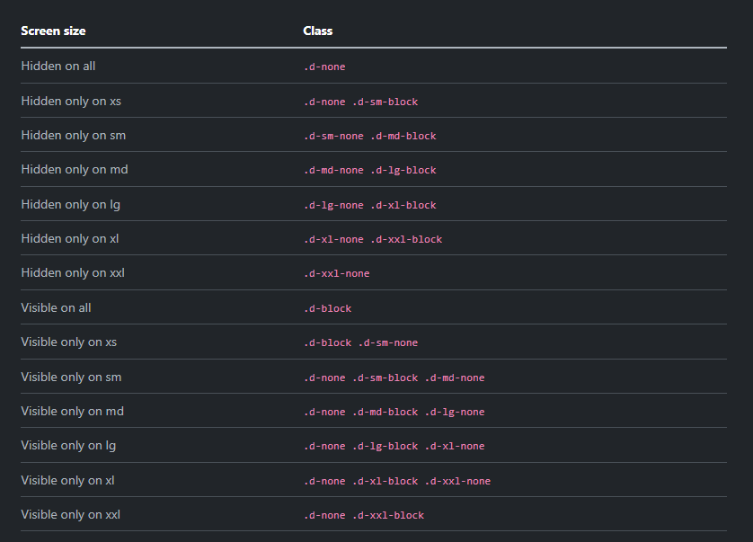
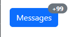

# Display & Position

Let's take a look at some of the display and position classes that Bootstrap provides.

## Display

There are classes for all of the possible display values.

- `d-none` - hide an element
- `d-inline` - display an element as an inline element
- `d-inline-block` - display an element as an inline element, but allow it to have a width and height
- `d-block` - display an element as a block element
- `d-table` - display an element as a table
- `d-table-row` - display an element as a table row
- `d-table-cell` - display an element as a table cell
- `d-flex` - display an element as a flex container
- `d-inline-flex` - display an element as an inline flex container
- `d-grid` - display an element as a grid container

Let's look at some of the most common ones.

### `d-none`

This class will hide an element. Let's add it to a paragraph.

```html
<p class="d-none">This paragraph is hidden</p>
```

## `d-inline`

When an element is inline it will not have a width or height. It will only take up as much space as it needs.
Some elements such as `<span>` and `<a>` are inline by default. `<p>` and `<div>` are block elements by default.

Let's add the inline class to some paragraphs.

```html
<div class="d-inline">This paragraph is inline</div>
<div class="d-inline">This paragraph is inline</div>
```

As you can see, they are now on the same line, right next to each other.

## `d-block`

When an element is block it will take up the entire width of the page. It will also have a height. Let's use this class on some `<span>` elements, which are inline by default.

```html
<span class="d-block">This span is block</span>
<span class="d-block">This span is block</span>
```

## `inline-block`

When an element is inline-block it will take up as much space as it needs, but it will also have a width and height. Let's use this class on some `<span>` elements, which are inline by default. I know that we have not gone over width classes yet, but i will use the width class of `w-25`, which will make the element 25% of the width of the page.

```html
<span class="d-inline-block w-25">This span is inline-block</span>
<span class="d-inline-block">This span is inline-block</span>
```

As you can see, they are on the same line, but I can add a width.

We will spend a whole lesson on the `d-flex` class when we get into flexbox. The `d-grid` class will display as a CSS grid, however, this class is very new and there is not a whole lot that we can do with it without adding custom CSS. One thing it is used for are block buttons, but I'll get into that later.

## Responsive Display

You can set the display value for different screen sizes. Here is a chart to help you better understand.



This is very helpful when you want to hide something on smaller screens for instance. Maybe it's just too cluttered and you want to minimize the UI. Let's take a look at an example.

```html
<div class="d-none d-md-block">This div is hidden on mobile</div>
```

The way that this works is we are initially setting display to `none`, but then we are saying that on medium screens and up, we want to set the display to `block`. So, on mobile, it will be hidden, but on medium screens and up, it will be block.

If you wanted to hide something on larger screens, you could do this:

```html
<div class="d-block d-md-none">This div is hidden on medium screens and up</div>
```

Now we are saying that on medium screens and up, we want to set the display to `block`, but on mobile, we want to set the display to `none`.

## Position

There are classes for all of the possible position values.

- `position-static` - default position
- `position-relative` - position relative to itself
- `position-absolute` - position relative to the first parent element that has a position other than static
- `position-fixed` - position relative to the viewport
- `position-sticky` - position relative to the viewport, but will scroll with the page until it reaches a certain point

Let's look at some of the most common ones.

### `position-static`

This is the default position. Let's add it to a paragraph.

```html
<p class="position-static">This paragraph is static</p>
```

### `position-relative` and `position-absolute`

When an element is positioned relative, it will be positioned relative to itself. When an element is positioned absolute, it will be positioned relative to the first parent element that has a position other than static.

To give you a good example, I will have to use some classes that we have not used yet. I want to have a button that is positioned `relative` and has a badge with a number positioned `absolute` inside of it.

Let's create the button. Again, don't worry about the extra classes, we will get to those.

```html
<button type="button" class="btn btn-primary position-relative">
  Messages
</button>
```

You have a button witht the primary color and a relative position. Now, let's add the badge.

```html
<button type="button" class="btn btn-primary position-relative">
  Messages
  <span
    class="position-absolute top-0 start-100 translate-middle badge rounded-pill bg-secondary"
    >+99 <span class="visually-hidden">unread messages</span></span
  >
</button>
```

The badge is positioned absolute, so it is positioned relative to the button. I used a class of `translate-middle`, which will center the badge vertically and horizontally. It is the same as using `transform: translate(-50%, -50%);`. Then I set it to the 0 top position and 100 start, which puts it in the top right corner.

So in addition to the position class, you have `top`, `bottom`, `start`, and `end`. `start` and `end` are the same as `left` and `right`.



### `position-fixed`

When an element is positioned fixed, it will be positioned relative to the viewport. Let's add a fixed position to a paragraph.

```html
<p class="position-fixed">This paragraph is fixed</p>
```

### `fixed-top` and `fixed-bottom`

You can stick elements to the top using the `fixed-top` class. You can stick elements to the bottom using the `fixed-bottom` class. Let's add a fixed top position to a paragraph.

```html
<p class="fixed-top">This paragraph is fixed top</p>
<p class='fixed-bottom">This paragraph is fixed bottom</p>
```

Now add a bunch of text to the page so that you can scroll. The paragraph will stay in the same position on the page.

### `sticky-top`

When an element is positioned sticky, it will be positioned relative to the viewport, but will scroll with the page until it reaches a certain point. The `sticky-top` class is a combination of `position: sticky` and `top: 0`. This is commonly used for navigation bars. Let's add a sticky position to a paragraph.

```html
<p class="sticky-top">This paragraph is sticky top</p>
```

Now scroll and this paragraph will stay in the same position on the page until it reaches the top of the page.
