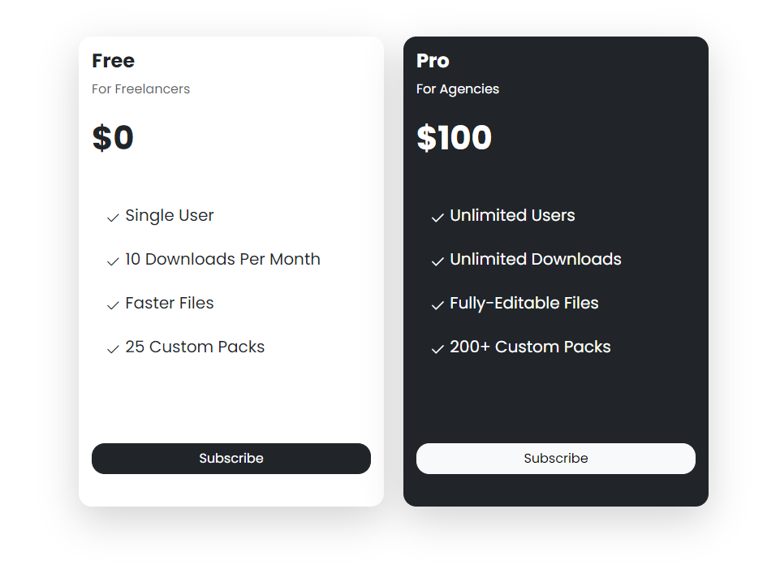

# Pricing Cards Mini Project

In this project, we will use Bootstrap 5 to create a couple of pricing cards. Here is what the final project will look like:



## Starter Files

Copy the mini-project starter files into a new folder, rename it to `pricing-cards` and then start working in the `index.html` file.

## Fonts & Icons

I want to use the Bootstrap 5 fonts. I usually opt for Font Awesome, but I think this is a good opportunity to use the Bootstrap icons.

To do this, we need to include the Bootstrap icons CSS file in the `<head>` of our HTML file:

```html
<link
  rel="stylesheet"
  href="https://cdn.jsdelivr.net/npm/bootstrap-icons@1.3.0/font/bootstrap-icons.css"
/>
```

I also want to use the `Poppins` font. So include that link as well:

```html
<link
  href="https://fonts.googleapis.com/css2?family=Poppins:wght@300;400;500;600;700&display=swap"
  rel="stylesheet"
/>
```

In the `style.css` file, apply the `Poppins` font to the `body`:

```css
body {
  font-family: 'Poppins', sans-serif;
}
```

## Create the Layout & Card 1

There are a lot of different approaches that we can take for layout. I am going to create a container and then use the Bootstrap grid system to create 2 columns. One for each card. The issue we will have is that the container will be too wide for the cards. We can fix this a few different ways. For now, I am going to add the class of `w-50` on the container, which will make it 50% wide. I should mention that later when we get into customizing with Sass, we can directly set the width of the container via Sass variable.

Let's create the container, grid and the first card:

```html
<div class="container w-50">
  <div class="row mt-5">
    <div class="col-md-6">
      <!-- Card 1 -->
      <div class="card rounded-4 shadow-lg border-0 mb-5">
        <div class="card-body">
          <div>
            <h4 class="fw-bold">Free</h4>
            <p class="text-muted">For Freelancers</p>
          </div>
          <h2 class="fs-1 fw-bold mt-4 mb-5">$0</h2>

          <ul class="list-group list-group-flush fs-5 vstack gap-2 mb-5">
            <li class="list-group-item border-0">
              <i class="bi bi-check2"></i> Single User
            </li>
            <li class="list-group-item border-0">
              <i class="bi bi-check2"></i> 10 Downloads Per Month
            </li>
            <li class="list-group-item border-0">
              <i class="bi bi-check2"></i> Faster Files
            </li>
            <li class="list-group-item border-0">
              <i class="bi bi-check2"></i> 25 Custom Packs
            </li>
          </ul>
          <div class="d-grid">
            <div class="btn btn-dark rounded-4 mt-5 mb-4">Subscribe</div>
          </div>
        </div>
      </div>
    </div>
    <div class="col-md-6">
      <!-- Card 2 -->
    </div>
  </div>
</div>
```

We used the `card` and `card-body` classes to create the card. This card will be the light one, so we didn't add a background. We also used the `list-group` class to create the list of features. We used the `d-grid` class to make the button full width.

I also added some margin classes and some font styles. We removed the border, made the corners rounded and added a shadow.

## Card 2

Now, let's create card 2:

```html
<!-- Card 2 -->
<div class="card text-bg-dark rounded-4 shadow-lg border-0">
  <div class="card-body">
    <div>
      <h4 class="fw-bold">Pro</h4>
      <p class="text-white">For Agencies</p>
    </div>
    <h2 class="fs-1 fw-bold mt-4 mb-5">$100</h2>

    <ul class="list-group list-group-flush fs-5 vstack gap-2 mb-5">
      <li class="list-group-item border-0 text-bg-dark">
        <i class="bi bi-check2"></i> Unlimited Users
      </li>
      <li class="list-group-item border-0 text-bg-dark">
        <i class="bi bi-check2"></i> Unlimited Downloads
      </li>
      <li class="list-group-item border-0 text-bg-dark">
        <i class="bi bi-check2"></i> Fully-Editable Files
      </li>
      <li class="list-group-item border-0 text-bg-dark">
        <i class="bi bi-check2"></i> 200+ Custom Packs
      </li>
    </ul>
    <div class="d-grid">
      <div class="btn btn-light rounded-4 mt-5 mb-4">Subscribe</div>
    </div>
  </div>
</div>
```

This card is dark and has white text. We used the `text-bg-dark` class to make the text white. We also used the `btn-light` class to make the button white.

## Container Width

It looks ok, but when we make the browser smaller, before it stacks, it looks too narrow. I would rather set a fixed width on the container.

Remove the class of `w-50` from the container and add this media query to the `style.css` file:

```css
@media (min-width: 800px) {
  .container {
    width: 800px;
  }
}
```

Now the cards will stay the same width until the browser is 800px wide. Then they will stack.
