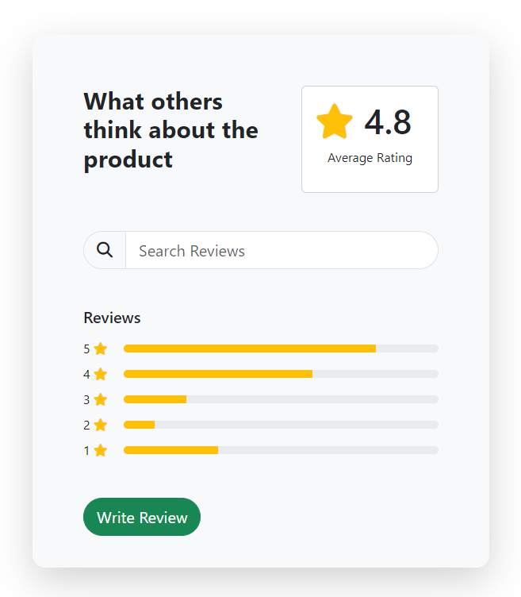

# Ratings Component

We are going to create a ratings component with a search form with an icon in it along with some progress bars for the 1 - 5 ratings. This is what it looks like:



## Starter Files

Copy the mini-project starter files and rename the folder to `ratings-component`.

## Font Awesome

We are using Font Awesome for the icons. Add the following to the `<head>` section of the `index.html` file:

```html
<link
  rel="stylesheet"
  href="https://cdnjs.cloudflare.com/ajax/libs/font-awesome/6.4.0/css/all.min.css"
  integrity="sha512-iecdLmaskl7CVkqkXNQ/ZH/XLlvWZOJyj7Yy7tcenmpD1ypASozpmT/E0iPtmFIB46ZmdtAc9eNBvH0H/ZpiBw=="
  crossorigin="anonymous"
  referrerpolicy="no-referrer"
/>
```

## Container Width

Just like with most of these mini-projects, I want the width to be pretty narrow. Open the `style.css` file and add the following:

```css
@media (min-width: 600px) {
  .container {
    width: 600px;
  }
}
```

This is the only custom CSS that we will write.

## Outline & Top Row

We are going to break each section into a row:

- Top row: Heading and Rating
- Second row: Search form
- Third row: Progress bars
- Fourth row: Button

Add the following HTML:

```html
<div class="container">
  <div class="card bg-light border-0 shadow-lg rounded-4 mt-5">
    <div class="card-body">
      <!-- Top Row -->
      <div class="row p-5">
        <div class="col-7">
          <h2 class="fw-bold">What others think about the product</h2>
        </div>
        <div class="col-5">
          <div class="card">
            <div class="card-body">
              <h3 class="display-5 fw-semibold">
                <i class="fas fa-star text-warning"></i> 4.8
              </h3>
              <p class="text-center">Average Rating</p>
            </div>
          </div>
        </div>
      </div>
    </div>
  </div>
</div>
```

We created the card with no border, a shadow, and rounded corners. We also added some top margin. We then created a row with two columns. The first column has a heading and the second column has a card with the average rating.

## Search Form

Under the top row, add the following:

```html
<!-- Search -->
<div class="row px-5">
  <div class="col-12">
    <div class="input-group input-group-lg">
      <span class="input-group-text rounded-start-5"
        ><i class="fas fa-search"></i
      ></span>
      <input
        type="text"
        class="form-control rounded-end-5"
        placeholder="Search Reviews"
      />
    </div>
  </div>
</div>
```

We are using an input group here. The first span has the search icon and the input has a placeholder. We made the right side of the input rounded with the `rounded-end-5` class and the left side rounded with the `rounded-start-5` class.

## Progress Bars

Now we can add the progress bars. Add the following:

```html
<!-- Ratings -->
<div class="row p-5">
  <div class="col-12 vstack gap-2">
    <h5>Reviews</h5>
    <div class="d-flex align-items-center gap-1">
      <span>5</span> <i class="fas fa-star text-warning"></i>
      <div
        class="progress ms-3"
        style="height: 20px; width: 100%; height: 10px"
      >
        <div
          class="progress-bar bg-warning"
          role="progressbar"
          style="width: 80%"
          aria-valuenow="80"
          aria-valuemin="0"
          aria-valuemax="100"
        ></div>
      </div>
    </div>

    <div class="d-flex align-items-center gap-1">
      <span>4</span> <i class="fas fa-star text-warning"></i>
      <div
        class="progress ms-3"
        style="height: 20px; width: 100%; height: 10px"
      >
        <div
          class="progress-bar bg-warning"
          role="progressbar"
          style="width: 60%"
          aria-valuenow="60"
          aria-valuemin="0"
          aria-valuemax="100"
        ></div>
      </div>
    </div>

    <div class="d-flex align-items-center gap-1">
      <span>3</span> <i class="fas fa-star text-warning"></i>
      <div
        class="progress ms-3"
        style="height: 20px; width: 100%; height: 10px"
      >
        <div
          class="progress-bar bg-warning"
          role="progressbar"
          style="width: 20%"
          aria-valuenow="20"
          aria-valuemin="0"
          aria-valuemax="100"
        ></div>
      </div>
    </div>

    <div class="d-flex align-items-center gap-1">
      <span>2</span> <i class="fas fa-star text-warning"></i>
      <div
        class="progress ms-3"
        style="height: 20px; width: 100%; height: 10px"
      >
        <div
          class="progress-bar bg-warning"
          role="progressbar"
          style="width: 10%"
          aria-valuenow="10"
          aria-valuemin="0"
          aria-valuemax="100"
        ></div>
      </div>
    </div>

    <div class="d-flex align-items-center gap-1">
      <span>1</span> <i class="fas fa-star text-warning"></i>
      <div
        class="progress ms-3"
        style="height: 20px; width: 100%; height: 10px"
      >
        <div
          class="progress-bar bg-warning"
          role="progressbar"
          style="width: 30%"
          aria-valuenow="30"
          aria-valuemin="0"
          aria-valuemax="100"
        ></div>
      </div>
    </div>
  </div>
</div>
```

We used the `d-flex` class to make a row of the rating, icon and progress bar. Each progress bar has a width that is a percentage. The first one is 80%, the second is 60%, etc. We also made the height of the progress bars 10px.

## Button

Finally, we can add the button. Add the following:

```html
<div class="row px-5 pb-4">
  <div class="col-12">
    <a href="#" class="btn btn-success btn-lg rounded-5">Write Review</a>
  </div>
</div>
```

That's it! We have finished the ratings component.
