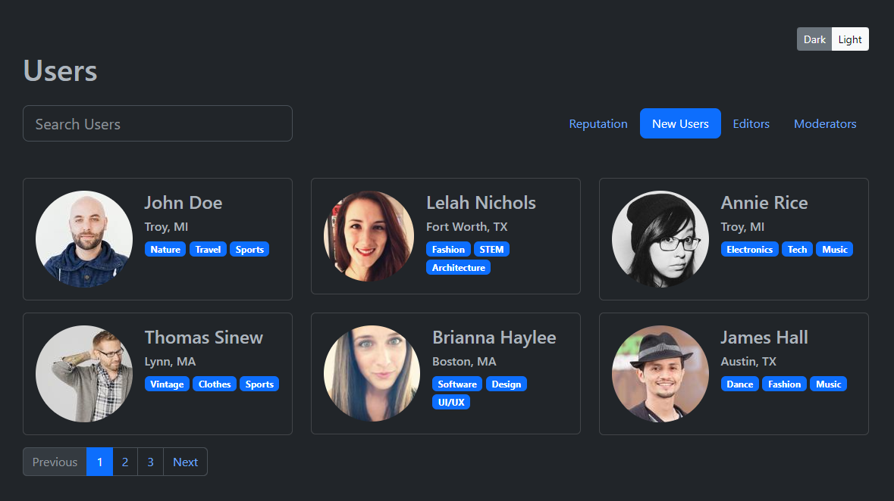
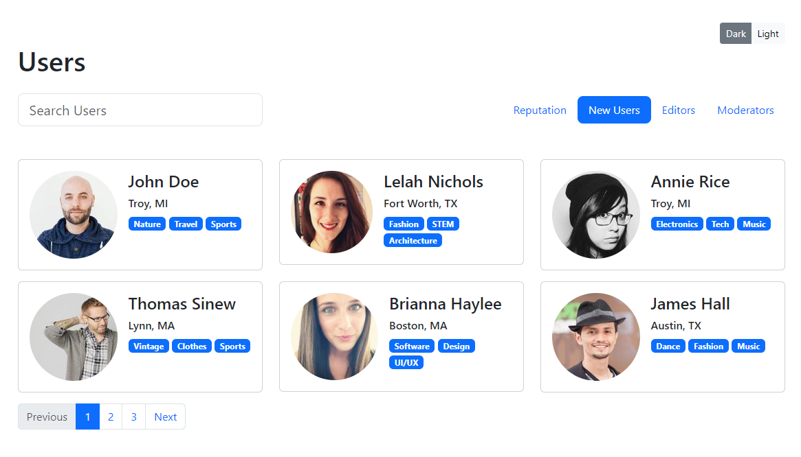

# User List

In this mini-project, we will create a user list with a search box, a horizontal navigation, a list of users in cards and some pagination links. We will also add a popover that will show that user's email address. In addition, we will implement a dark/light mode toggle. It will look like this:





## Starter Files

Copy the mini-project starter files and rename it to `user-list`.

## Enable Dark Mode

We will build out the project in dark mode first and then we will add the toggler to switch to light mode.

Add the `data-bs-theme="dark"` attribute to the `html` element. This will set the default theme to dark mode. We will add the toggler later.

```html
<html lang="en" data-bs-theme="dark"></html>
```

## The Header

The header will be the heading, searchbox and menu.

Add the following HTML to the `index.html` file:

```html
<header class="mb-5">
  <div class="container mt-5">
    <div class="d-flex justify-content-end">
      <div class="btn-group">
        <button class="btn btn-sm btn-secondary" data-bs-theme-value="dark">
          Dark
        </button>
        <button class="btn btn-sm btn-light" data-bs-theme-value="light">
          Light
        </button>
      </div>
    </div>
    <h1 class="mb-4">Users</h1>
    <div class="row">
      <div class="col-md-4">
        <input
          type="text"
          class="form-control form-control-lg"
          placeholder="Search Users"
        />
      </div>
      <div
        class="user-menu col-md-8 d-flex justify-content-end align-items-center"
      >
        <ul class="nav">
          <li class="nav-item">
            <a class="nav-link" href="#">Reputation</a>
          </li>
          <li class="nav-item">
            <a class="nav-link text-bg-primary rounded-3" href="#">New Users</a>
          </li>
          <li class="nav-item">
            <a class="nav-link" href="#">Editors</a>
          </li>
          <li class="nav-item">
            <a class="nav-link" href="#">Moderators</a>
          </li>
        </ul>
      </div>
    </div>
  </div>
</header>
```

Notice this time, I added a `container` within the `header`. This is usually what you will do in larger projects because you probably won't want to limit the overall width of everything by wrapping it in a container. You may want a background color to go all the way across the screen. So, you will add a container within the header and then you can add a container within the main content area.

We are using the Bootstrap grid for the overall layout and we are using the `d-flex` class for the navigation to align the items horizontally. We made one of the items stand out by adding a background of the primary color.

## The User Cards

Let's add the user cards right under the header:

```html
<!-- User List -->
<main>
  <div class="container">
    <!-- Row 1 -->
    <div class="row">
      <div class="col-md-4">
        <div
          class="card mb-3"
          data-bs-container="body"
          data-bs-toggle="popover"
          data-bs-placement="top"
          data-bs-content="Email: John@gmail.com"
        >
          <div class="card-body">
            <div class="d-flex gap-3">
              <div class="user-img">
                
              </div>
              <div class="user-info">
                <h4>John Doe</h4>
                <h6>Troy, MI</h6>
                <span class="badge bg-primary">Nature</span>
                <span class="badge bg-primary">Travel</span>
                <span class="badge bg-primary">Sports</span>
              </div>
            </div>
          </div>
        </div>
      </div>

      <div class="col-md-4">
        <div
          class="card mb-3"
          data-bs-container="body"
          data-bs-toggle="popover"
          data-bs-placement="top"
          data-bs-content="Email: lelah@gmail.com"
        >
          <div class="card-body">
            <div class="d-flex gap-3">
              <div class="user-img">
                
              </div>
              <div class="user-info">
                <h4>Lelah Nichols</h4>
                <h6>Fort Worth, TX</h6>
                <span class="badge bg-primary">Fashion</span>
                <span class="badge bg-primary">STEM</span>
                <span class="badge bg-primary">Architecture</span>
              </div>
            </div>
          </div>
        </div>
      </div>

      <div class="col-md-4">
        <div
          class="card mb-3"
          data-bs-container="body"
          data-bs-toggle="popover"
          data-bs-placement="top"
          data-bs-content="Email: annie@gmail.com"
        >
          <div class="card-body">
            <div class="d-flex gap-3">
              <div class="user-img">
                
              </div>
              <div class="user-info">
                <h4>Annie Rice</h4>
                <h6>Troy, MI</h6>
                <span class="badge bg-primary">Electronics</span>
                <span class="badge bg-primary">Tech</span>
                <span class="badge bg-primary">Music</span>
              </div>
            </div>
          </div>
        </div>
      </div>
    </div>

    <!-- Row 2 -->
    <div class="row">
      <div class="col-md-4">
        <div
          class="card mb-3"
          data-bs-container="body"
          data-bs-toggle="popover"
          data-bs-placement="top"
          data-bs-content="Email: Thomas@gmail.com"
        >
          <div class="card-body">
            <div class="d-flex gap-3">
              <div class="user-img">
                
              </div>
              <div class="user-info">
                <h4>Thomas Sinew</h4>
                <h6>Lynn, MA</h6>
                <span class="badge bg-primary">Vintage</span>
                <span class="badge bg-primary">Clothes</span>
                <span class="badge bg-primary">Sports</span>
              </div>
            </div>
          </div>
        </div>
      </div>

      <div class="col-md-4">
        <div
          class="card mb-3"
          data-bs-container="body"
          data-bs-toggle="popover"
          data-bs-placement="top"
          data-bs-content="Email: Brianna@gmail.com"
        >
          <div class="card-body">
            <div class="d-flex gap-3">
              <div class="user-img">
                
              </div>
              <div class="user-info">
                <h4>Brianna Haylee</h4>
                <h6>Boston, MA</h6>
                <span class="badge bg-primary">Software</span>
                <span class="badge bg-primary">Design</span>
                <span class="badge bg-primary">UI/UX</span>
              </div>
            </div>
          </div>
        </div>
      </div>

      <div class="col-md-4">
        <div
          class="card mb-3"
          data-bs-container="body"
          data-bs-toggle="popover"
          data-bs-placement="top"
          data-bs-content="Email: james@gmail.com"
        >
          <div class="card-body">
            <div class="d-flex gap-3">
              <div class="user-img">
                
              </div>
              <div class="user-info">
                <h4>James Hall</h4>
                <h6>Austin, TX</h6>
                <span class="badge bg-primary">Dance</span>
                <span class="badge bg-primary">Fashion</span>
                <span class="badge bg-primary">Music</span>
              </div>
            </div>
          </div>
        </div>
      </div>
    </div>
  </div>
</main>
```

I wrapped the rest of the page in a `main` element. We have a container within this element as well. We have 2 rows of 3 columns on medium screens. We are using `d-flex` inside of the cards and the `gap-3` class to add a gap between the user image and the user info.

I am using the randomuser API links to get images of people. You can use the same links or you can use your own images.

Then we have the user name, location and some categories in badges.

## Popover

We are using the Bootstrap popover component to show the email address when you click on a card. We are using the `data-bs-container` attribute to set the container to the body. This is so that the popover will show up outside of the card. We are using the `data-bs-toggle` attribute to set the popover to toggle. We are using the `data-bs-placement` attribute to set the placement to the top. We are using the `data-bs-content` attribute to set the content to the email address.

In order for this to work, you need to add the following script to the bottom of the `body` element:

```HTML
 <script>
      const popoverTriggerList = document.querySelectorAll(
        '[data-bs-toggle="popover"]'
      );
      const popoverList = [...popoverTriggerList].map(
        (popoverTriggerEl) => new bootstrap.Popover(popoverTriggerEl)
      );
  </script>
```

Now try clicking on a card.

## Pagination

Now, let's add the html for the pagination. Obviously, this will not work. That is beyond this course, but we will add the UI. Put the following under the `row` class in the `main` element:

```html
<nav>
  <ul class="pagination">
    <li class="page-item">
      <a class="page-link disabled" href="#">Previous</a>
    </li>
    <li class="page-item active">
      <a class="page-link" href="#">1</a>
    </li>
    <li class="page-item"><a class="page-link" href="#">2</a></li>
    <li class="page-item"><a class="page-link" href="#">3</a></li>
    <li class="page-item"><a class="page-link" href="#">Next</a></li>
  </ul>
</nav>
```

## Mode Toggler

We need to add the JS to toggle the mode. You can get the code from [https://getbootstrap.com/docs/5.3/customize/color-modes/#javascript](https://getbootstrap.com/docs/5.3/customize/color-modes/#javascript)

Create a file in `js` called `darkmodetoggle.js` and add the code from that page. Then link it in the `index.html` file:

```html
<script src="js/darkmodetoggle.js"></script>
```

Now we are going to add our buttons at the top. In the `header`, just above the `h1`, add the following:

```html
<div class="container mt-5">
  <div class="d-flex justify-content-end">
    <div class="btn-group">
      <button class="btn btn-sm btn-secondary" data-bs-theme-value="dark">
        Dark
      </button>
      <button class="btn btn-sm btn-light" data-bs-theme-value="light">
        Light
      </button>
    </div>
  </div>
</div>
```

Now you should be able to toggle between light and dark mode.
