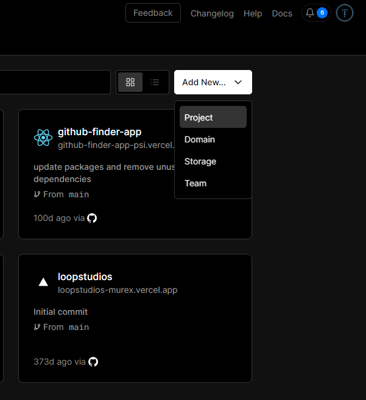
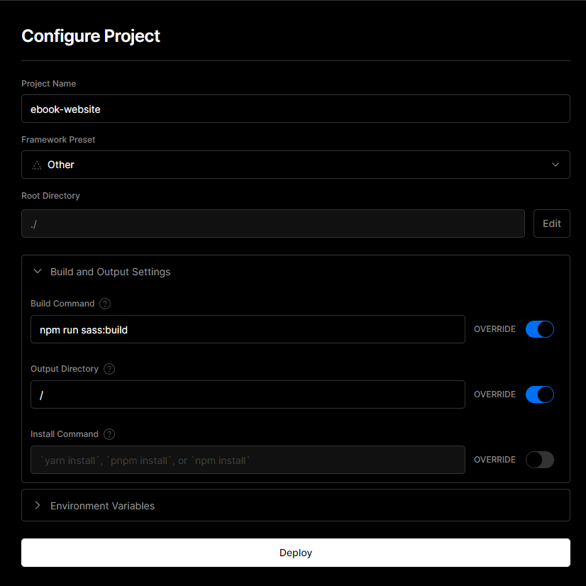
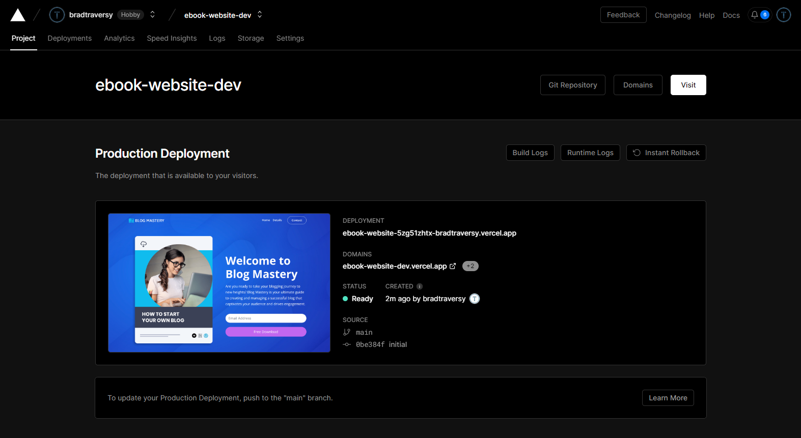

# Deploy To Vercel

I know that this goes a bit beyond the scope of this course, but I want to make sure you know how to deploy your websites. There are a ton of services out there and all different types of hosting. For a static website like this, [Vercel](https://vercel.com/ambassadors/bradtraversy) is a great option. You basically just push to a github repo, login to Vercel and then choose the repo you want to deploy. It's that simple. There is also a service we can use called Formspree that will allow us to hook up our form to an email address. Let's get started.

## Push To Github

If you do not have a Github account, create one now. Every developer of any kind should have a Github account. It's free and it's a great way to showcase your work. Once you have an account, create a new repository. You can name it whatever you want. I am going to name mine `ebook-website`. Make sure you do not initialize with a README. We already have one. Once you create the repo, you will see some instructions on how to push your code to Github. Let's do that now. You can do this using VS Code or via the terminal. I am going to do it via the terminal in case some of you are not using VS Code.

Open your terminal and type the following commands:

```bash
git init
git add .
git commit -m "Initial Commit"
```

First we initialized a git repository. Then we added all of our files to the staging area. Then we committed them to the repo. Now we need to add the remote repo and push our code to it. You should see the instructions on how to do this in the Github repo you created. It should look something like this:

```bash
  git remote add origin https://github.com/youraccount/ebook-website.git   #(This will be your own repo/account)
  git branch -M main
  git push -u origin main
```

Now your code is pushed to Github. Let's move on to Vercel.

## Vercel

I am an affiliate with Vercel, so I would really appreciate if you could use my link. You can do everything here absolutley free with no CC info. If you choose to upgrade, I will just get a small commission. Thanks!

[https://vercel.com/ambassadors/bradtraversy](https://vercel.com/ambassadors/bradtraversy)

Once you are in the dashboard, click on `Add New->Project`:



Then select the repo you just created:

When you get to the config options, you want to add the Sass build command. Because remember, the `css` folder is not in the repo. It is generated by Sass. So we need to tell Vercel to run the build command before deploying. So in the `Build Command` field, Choose `override` and add `npm run sass:build`:

You also want to override the output directory. By default, it is `public`. Change it to `/`:



Noe click `Deploy` and you should see a success message and a screen like this:



Click `Visit` to see your site.

You will get a `.vercel.app` domain, but you can easily add a domain that you purchase from a registrar like Namecheap. Then you have to update the DNS settings. That is all in the documentation. I will just use the Vercel domain for now.

In the next lesson, I will show you how we can make the form work.
