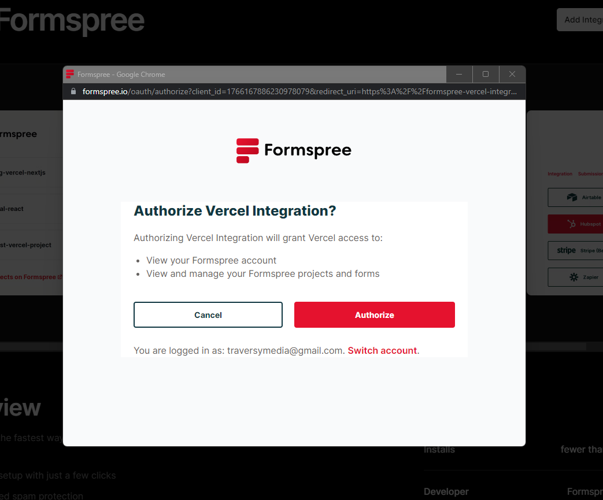
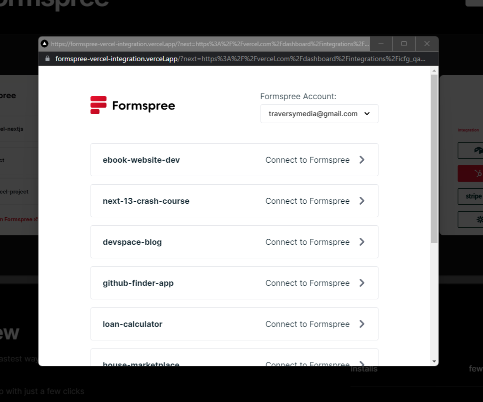
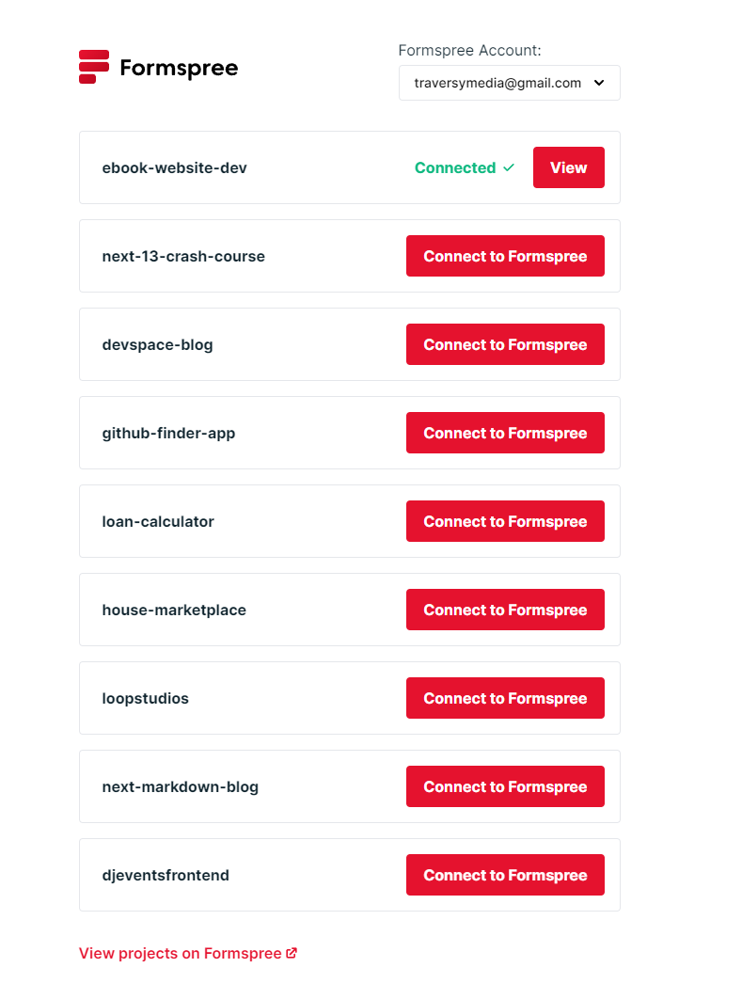
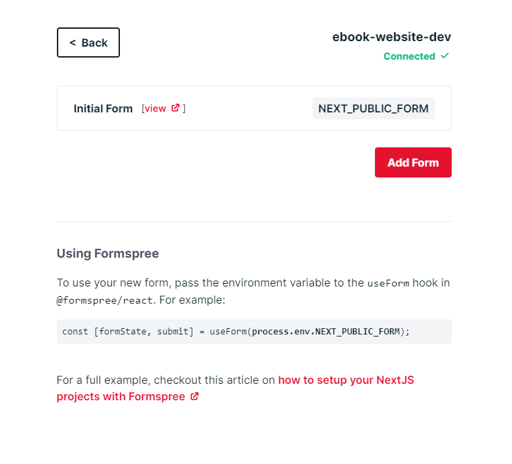
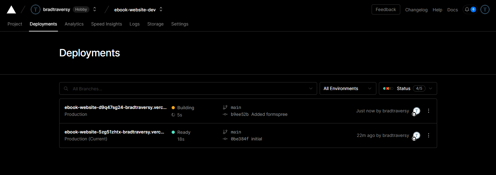
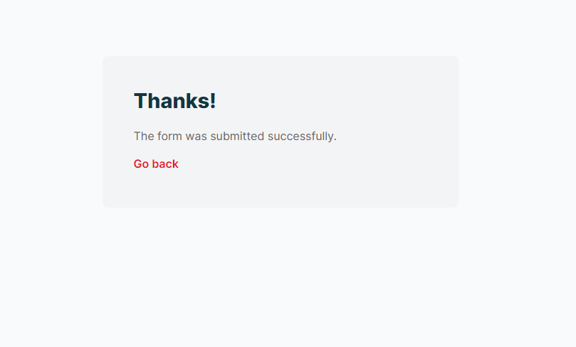
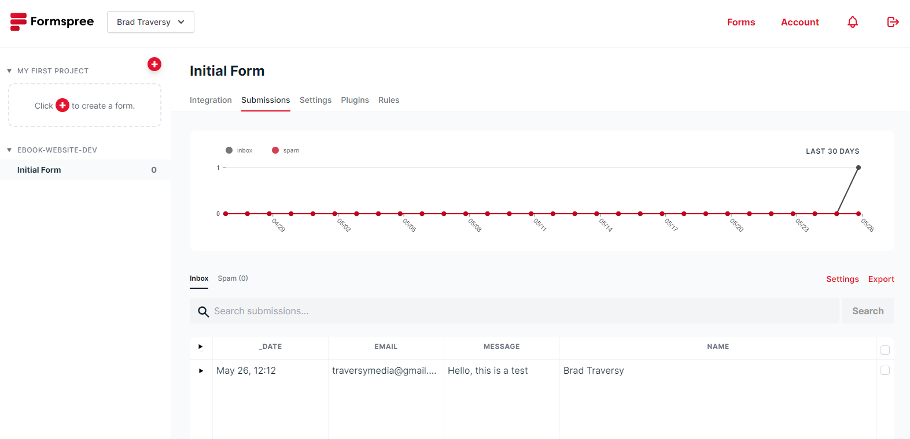

# Integrate Formspree

Now that we have our site deployed, let's make the contact form work. We will use a service called [Formspree](https://formspree.io/). It's free and easy to use. You can also upgrade to a paid plan if you need more features.

Go to https://vercel.com/integrations/formspree and click `Add Integration`. Select your Vercel account and click `continue`. Then it will ask if you want to use this integration with `All Projects` or `Specific Projects`. Let's choose `All Projects` and then `continue`. Then click `Add Integration`.

Now you will be asked to register with Formspree, so just fill out the form with your name, email and password.

Now it will ask to authorize Vercel:



Click `Authorize`.

Now click `Connect To Formspree` for the ebook website project.



Next you can choose `Dashboard` or `CLI` to manage forms. Choose `Dashboard` and then click `Done`.

Now you have an integration with that project.

Now click `Configure` and you will see a screen like this with your projects:



Click `View` and you will see a screen like this:



You have an "inital form". Go ahead and click `View`

From here you can see all submissions, enable plugins and more. You get more features with a paid account, but I am pretty sure that we can handle up to 1000 submissions per month with the free account.

We want to add the form to our website so click on `Integration` and then the `HTML` tab.

All we have to do is add the action, method and name attributes to our form. So let's go to our `contact.html` file and add the following code:

```html
<form action="https://formspree.io/f/YOUR_FORM_ID" method="POST">
  <div class="mb-3">
    <input
      type="text"
      name="name"
      class="form-control form-control-lg"
      placeholder="Name"
    />
  </div>
  <div class="mb-3">
    <input
      type="email"
      name="email"
      class="form-control form-control-lg"
      placeholder="Email"
    />
  </div>
  <div class="mb-3">
    <textarea
      name="message"
      class="form-control form-control-lg"
      placeholder="Message"
      rows="6"
    ></textarea>
    <div class="d-grid">
      <button class="btn btn-primary text-white mt-5">Submit</button>
    </div>
  </div>
</form>
```

Replace `YOUR_FORM_ID` with the form id from Formspree. You can find it in the `HTML` tab of the form.

Now, just save and push to GitHub with the following commands:

```bash
git add .
git commit -m "added formspree"
git push
```

Vercel should automatically deploy the site. You can go into the `Deployments` tab and see the progress.



## Submit The Form

Now go to your website and submit the contact form. You should see a success message like this:



GO to yout Formspree dashboard and click on `Submissions` and you should see the submission.



That's it! you have a deployed website with a working contact form.
