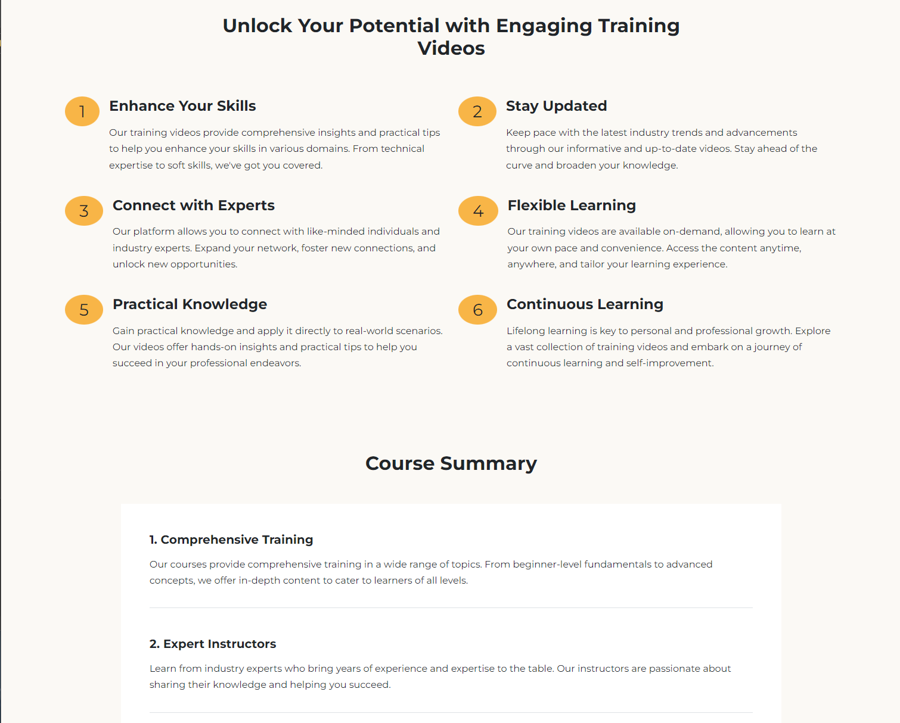

# Points, Course Summary & Details 2 Sections

The next sections will be a list of points with a styled number, a course summary and another details section with an image and text.

## Points Section

Let's start with the points section.

Add the following code to the `index.html` file:

```html
<!-- Points -->
<section class="points pb-5">
  <div class="container">
    <div class="row text-center mb-5">
      <div class="col-md-8 offset-md-2">
        <h2>Unlock Your Potential with Engaging Training Videos</h2>
      </div>
    </div>
    <div class="row">
      <div class="col-md-6 mb-4">
        <div class="d-flex gap-3">
          <div class="number">
            <span class="bg-primary py-2 px-4 fs-3 rounded-circle">1</span>
          </div>
          <div>
            <h3 class="fs-4">Enhance Your Skills</h3>
            <p>
              Our training videos provide comprehensive insights and practical
              tips to help you enhance your skills in various domains. From
              technical expertise to soft skills, we've got you covered.
            </p>
          </div>
        </div>
      </div>

      <div class="col-md-6 mb-4">
        <div class="d-flex gap-3">
          <div class="number">
            <span class="bg-primary py-2 px-4 fs-3 rounded-circle">2</span>
          </div>
          <div>
            <h3 class="fs-4">Stay Updated</h3>
            <p>
              Keep pace with the latest industry trends and advancements through
              our informative and up-to-date videos. Stay ahead of the curve and
              broaden your knowledge.
            </p>
          </div>
        </div>
      </div>

      <div class="col-md-6 mb-4">
        <div class="d-flex gap-3">
          <div class="number">
            <span class="bg-primary py-2 px-4 fs-3 rounded-circle">3</span>
          </div>
          <div>
            <h3 class="fs-4">Connect with Experts</h3>
            <p>
              Our platform allows you to connect with like-minded individuals
              and industry experts. Expand your network, foster new connections,
              and unlock new opportunities.
            </p>
          </div>
        </div>
      </div>

      <div class="col-md-6 mb-4">
        <div class="d-flex gap-3">
          <div class="number">
            <span class="bg-primary py-2 px-4 fs-3 rounded-circle">4</span>
          </div>
          <div>
            <h3 class="fs-4">Flexible Learning</h3>
            <p>
              Our training videos are available on-demand, allowing you to learn
              at your own pace and convenience. Access the content anytime,
              anywhere, and tailor your learning experience.
            </p>
          </div>
        </div>
      </div>

      <div class="col-md-6 mb-4">
        <div class="d-flex gap-3">
          <div class="number">
            <span class="bg-primary py-2 px-4 fs-3 rounded-circle">5</span>
          </div>
          <div>
            <h3 class="fs-4">Practical Knowledge</h3>
            <p>
              Gain practical knowledge and apply it directly to real-world
              scenarios. Our videos offer hands-on insights and practical tips
              to help you succeed in your professional endeavors.
            </p>
          </div>
        </div>
      </div>

      <div class="col-md-6 mb-4">
        <div class="d-flex gap-3">
          <div class="number">
            <span class="bg-primary py-2 px-4 fs-3 rounded-circle">6</span>
          </div>
          <div>
            <h3 class="fs-4">Continuous Learning</h3>
            <p>
              Lifelong learning is key to personal and professional growth.
              Explore a vast collection of training videos and embark on a
              journey of continuous learning and self-improvement.
            </p>
          </div>
        </div>
      </div>
    </div>
  </div>
</section>
```

We want two points/columns per row on medium and larger screens, so we'll use the `col-md-6` class. Notice that we only used one `row` class even though there are 3 rows. That is absolutely fine. You do not have to add a new `row` class for each row of content.

We used `d-flex` to align the number and the content in a row. We also added a circle around the numbers.

## Course Summary

Now we just want a few overview points about the course.

Add the following section to the `index.html` file:

```html
<!-- Course Summary -->
<section id="summary" class="summary bg-light mt-5 w-75 m-auto">
  <div class="container">
    <div class="row">
      <div class="col-12">
        <h2 class="text-center mb-5">Course Summary</h2>
      </div>
    </div>
    <div class="row">
      <div class="col-12">
        <div class="bg-white p-5">
          <ul class="list-unstyled">
            <li class="border-bottom pb-3">
              <h5>1. Comprehensive Training</h5>
              <p>
                Our courses provide comprehensive training in a wide range of
                topics. From beginner-level fundamentals to advanced concepts,
                we offer in-depth content to cater to learners of all levels.
              </p>
            </li>
            <li class="border-bottom pb-3 pt-5">
              <h5>2. Expert Instructors</h5>
              <p>
                Learn from industry experts who bring years of experience and
                expertise to the table. Our instructors are passionate about
                sharing their knowledge and helping you succeed.
              </p>
            </li>
            <li class="pb-3 pt-5">
              <h5>3. Practical Application</h5>
              <p>
                We believe in practical learning that goes beyond theory. Our
                courses focus on real-world application, equipping you with the
                skills and knowledge needed to excel in your field.
              </p>
            </li>
          </ul>
        </div>
      </div>
    </div>
  </div>
</section>
```

We made the width of this section a little smaller by using the `w-75` class and then `m-auto` to center it on the page.

### Small Screen Width

On small screens, I don't want the smaller 75% width, because it will be too small. So we'll add a media query to make it full width on small screens. We will also get rid of the top margin.

Add the following to the media query in the `scss/styles.scss` file:

```css
@media (max-width: 992px) {
  // ...

  .summary {
    margin-top: 0 !important;
    width: 90% !important;
  }
}
```

## Details Section

Now we will add a similar details section to the one we added earlier.

Add the following section to the `index.html` file:

```html
<!-- Details 2 -->
<section class="details py-6 bg-light">
  <div class="container">
    <div class="row">
      <div class="col-lg-6">
        
      </div>
      <div class="col-lg-6 d-flex flex-column justify-content-center">
        <h2>Elevate Your Learning Journey with Expert Seminars</h2>
        <p>
          Join our expert-led seminars and unlock new possibilities in your
          personal and professional development. Our seminars cover a diverse
          range of topics, from leadership and innovation to personal growth and
          productivity.
        </p>
        <p>
          Immerse yourself in engaging discussions, interactive workshops, and
          valuable networking opportunities.
        </p>
      </div>
    </div>
  </div>
</section>
```

Again, I wanted to center the text on the page, so I used `d-flex`, `flex-column` and `justify-content-center` to do that.

Here is what it will look like:


