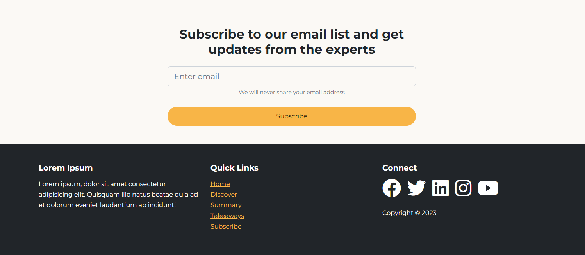

# Subscribe Form & Footer

The final two sections will be a simple form for subscribing to a newsletter and a footer.

## Subscribe Form

Add the following section to the `index.html` file:

```html
<!-- Subscribe -->
<section id="subscribe" class="subscribe my-5">
  <div class="container">
    <div class="row">
      <div class="col-md-6 offset-md-3 text-center">
        <h2>Subscribe to our email list and get updates from the experts</h2>
        <form>
          <div class="my-4">
            <input
              type="email"
              class="form-control form-control-lg"
              placeholder="Enter email"
            />
            <div class="form-text">We will never share your email address</div>
          </div>
          <div class="d-grid">
            <button class="btn btn-primary">Subscribe</button>
          </div>
        </form>
      </div>
    </div>
  </div>
</section>
```

This section is very simple. It has a heading, a form, and a button. The form has an input for an email address and a text below it.

## Footer

The footer will have 3 columns. One for some text, one for links, and one for social media icons.

Add the following section to the `index.html` file:

```html
<!-- Footer -->
<footer class="footer mt-4 text-bg-dark py-5">
  <div class="container">
    <div class="row">
      <div class="col-md-4">
        <h5>Lorem Ipsum</h5>
        <p>
          Lorem ipsum, dolor sit amet consectetur adipisicing elit. Quisquam
          illo natus beatae quia ad et dolorum eveniet laudantium ab incidunt!
        </p>
      </div>
      <div class="col-md-4">
        <h5>Quick Links</h5>
        <ul class="list-unstyled">
          <li><a href="#home">Home</a></li>
          <li><a href="#discover">Discover</a></li>
          <li><a href="#summary">Summary</a></li>
          <li><a href="#takeaways">Takeaways</a></li>
          <li><a href="#subscribe">Subscribe</a></li>
        </ul>
      </div>
      <div class="col-md-4">
        <h5>Connect</h5>
        <div class="d-flex gap-3">
          <a href="#!"><i class="fab fa-facebook fa-3x text-white"></i></a>

          <a href="#!"><i class="fab fa-twitter fa-3x text-white"></i></a>

          <a href="#!"><i class="fab fa-linkedin fa-3x text-white"></i></a>

          <a href="#!"><i class="fab fa-instagram fa-3x text-white"></i></a>

          <a href="#!"><i class="fab fa-youtube fa-3x text-white"></i></a>
        </div>
        <div class="mt-4">Copyright &copy; 2023</div>
      </div>
    </div>
  </div>
</footer>
```

That's it! These sections should look like this:


