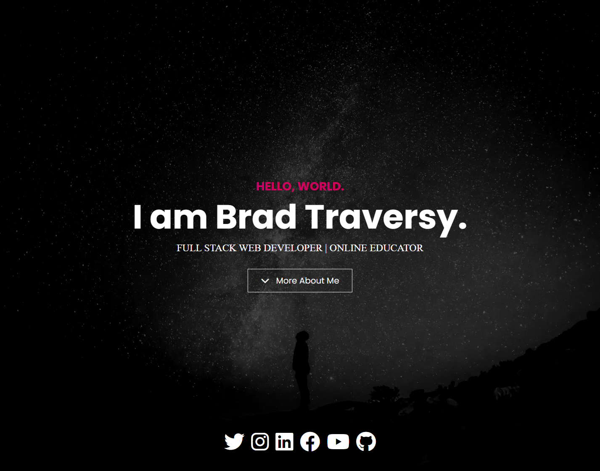

# Header With Overlay

We are going to start out with the header/hero. This is the first time we have a main header/hero area that takes up the full height of the viewport. We will also be adding a dark overlay to the background image. If we don't, the text will be hard to read.

Let's start by adding the following html. And of course, you may want to change the name to your own:

```html
<header class="header vh-100 text-center position-relative">
  <div
    class="text-container position-relative d-flex flex-column justify-content-center align-items-center h-100"
  >
    <h5 class="text-primary fs-3 fw-bold text-uppercase">Hello, World.</h5>
    <h1 id="typing-text" class="display-1 fw-bold text-white">
      I am Brad Traversy
    </h1>

    <p class="roles text-white text-uppercase fs-4">
      <span>Full Stack Web Developer |</span>
      <span>Online Educator</span>
    </p>

    <a class="btn btn-outline-light btn-lg mt-3" href="#about" title="">
      <div class="d-flex">
        <div class="me-3">
          <i class="fas fa-chevron-down"></i>
        </div>
        <div class="text-start">
          <span>More About Me</span>
        </div>
      </div>
    </a>

    <div class="social d-flex gap-3 position-absolute">
      <a href="#">
        <i class="fab fa-twitter fa-3x text-white"></i>
      </a>
      <a href="#">
        <i class="fab fa-instagram fa-3x text-white"></i>
      </a>
      <a href="#">
        <i class="fab fa-linkedin fa-3x text-white"></i>
      </a>
      <a href="#">
        <i class="fab fa-facebook fa-3x text-white"></i>
      </a>
      <a href="#">
        <i class="fab fa-youtube fa-3x text-white"></i>
      </a>
      <a href="#">
        <i class="fab fa-github fa-3x text-white"></i>
      </a>
    </div>
  </div>
</header>
```

I will explain what I did here:

We made the header `v-100` because we want it to take up the full height of the viewport. We also made it `position-relative` so we can position the overlay over the background image. It is important to note that we did not add the overlay div. That's because we are going to use a pseudo element of `::after` to add the overlay.

Next, we add the text container around everything inside the header. I made it a flexbox and centered everything inside of it. I also made it `position-relative` so we can position the social icons at the bottom of the relative header.

I added the id of `typing-text` to the h1 because we will be using JavaScript to make the text type out. We'll do that in the next lesson.

## The Overlay

We need to add some custom CSS for the overlay. Open the `scss/styles.scss` file and add the following:

```scss
// Header
.header {
  background: #151515 url(../images/intro-bg.jpg) no-repeat center bottom;
  background-size: cover;
  background-attachment: fixed;
}

// Header Overlay
.header::after {
  content: '';
  position: absolute;
  top: 0;
  left: 0;
  width: 100%;
  height: 100%;
  background: rgba(0, 0, 0, 0.7);
}

.header .text-container {
  z-index: 10;
}

.header .roles {
  font-family: 'lora-regular', serif;
}

.header .social {
  bottom: 50px;
}
```

I want the roles text and the social icons to be a bit smaller on small screens, so add the following media query to the bottom of the file:

```scss
@media (max-width: 767px) {
  .header .social i {
    font-size: 30px;
  }

  .header .roles {
    font-size: 18px !important;
  }
}
```

I added the background image and positioning to the header. Then I used the `::after` pseudo element to add the overlay. I made it `position-absolute` and gave it a `z-index` of 1 so it would be behind the text. I also added the `roles` class to the roles paragraph so we can change the font-family to `lora-regular`.

Here is the result:


