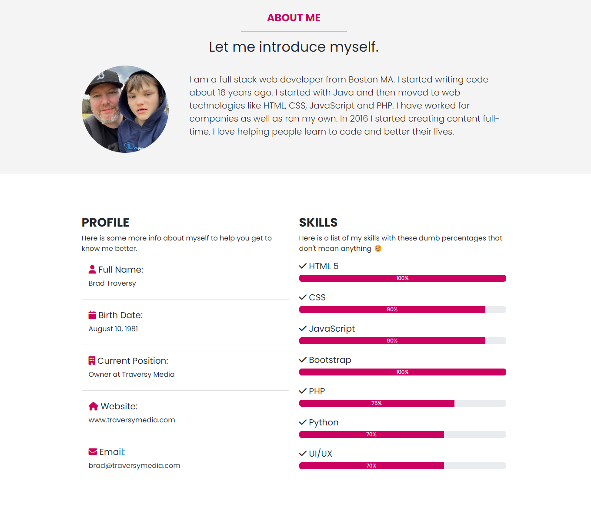

# About & Skills

In this part, we will add a small about page with a picture and text and then under it, some more info along with some progress bars with skills. The bars are just for practice. I wouldn't recommend using them on a real portfolio website. They are pointless and don't really tell you anything. But they are a good way to practice some CSS.

## About Me Section

Of course, you can change all the content to your own. Let's add this right under the header:

```html
<!-- About -->
<section id="about" class="about bg-light py-5">
  <div class="container">
    <div class="text-center">
      <h4 class="text-uppercase fw-bold text-primary">About Me</h4>
      <hr class="w-25 mx-auto" />

      <h2 class="mb-4">Let me introduce myself.</h2>
    </div>

    <div class="about-content d-flex gap-5 align-items-center h-100">
      

      <p class="lead">
        I am a full stack web developer from Boston MA. I started writing code
        about 16 years ago. I started with Java and then moved to web
        technologies like HTML, CSS, JavaScript and PHP. I have worked for
        companies as well as ran my own. In 2016 I started creating content
        full-time. I love helping people learn to code and better their lives.
      </p>
    </div>
  </div>
</section>
```

Pretty simple. We have a heading, hr, and a paragraph. I also added a picture of me and my son. Feel free to change it. I used `d-flex` for the layout.

I want to limit the width of the image, so in the CSS, let's add this to the `scss/styles.scss` file:

```css
.about-img {
  width: 200px;
}
```

I also want the items to be in a vertical column on small screens, so add the following in the media query:

```css
@media (max-width: 767px) {
  /* ... */

  .about-content {
    flex-direction: column;
  }
}
```

## Profile & Skills Section

We will have two even columns. One side for profile into and one for the skills with the progress bars. Let's add this right under the about section:

```html
<!-- Profile & Skills -->
<section class="profile my-6">
  <div class="container">
    <div class="row">
      <div class="col-md-6">
        <h3 class="text-uppercase fw-bold">Profile</h3>
        <p>
          Here is some more info about myself to help you get to know me better.
        </p>
        <ul class="list-group list-group-flush">
          <li class="list-group-item mb-3">
            <h5 class="text-transform">
              <i class="fas fa-user text-primary"></i> Full Name:
            </h5>
            <p>Brad Traversy</p>
          </li>
          <li class="list-group-item mb-3">
            <h5 class="text-transform">
              <i class="fas fa-calendar text-primary"></i> Birth Date:
            </h5>
            <p>August 10, 1981</p>
          </li>
          <li class="list-group-item mb-3">
            <h5 class="text-transform">
              <i class="fas fa-building text-primary"></i> Current Position:
            </h5>
            <p>Owner at Traversy Media</p>
          </li>
          <li class="list-group-item mb-3">
            <h5 class="text-transform">
              <i class="fas fa-home text-primary"></i> Website:
            </h5>
            <p>www.traversymedia.com</p>
          </li>
          <li class="list-group-item mb-3">
            <h5 class="text-transform">
              <i class="fas fa-envelope text-primary"></i> Email:
            </h5>
            <p>brad@traversymedia.com</p>
          </li>
        </ul>
      </div>
      <div class="col-md-6">
        <h3 class="text-uppercase fw-bold">Skills</h3>
        <p>
          Here is a list of my skills with these dumb percentages that don't
          mean anything 😉
        </p>

        <h5><i class="fas fa-check"></i> HTML 5</h5>
        <div
          class="progress mb-4"
          role="progressbar"
          aria-label="HTML 5"
          aria-valuenow="100"
          aria-valuemin="0"
          aria-valuemax="100"
        >
          <div class="progress-bar" style="width: 100%">100%</div>
        </div>

        <h5><i class="fas fa-check"></i> CSS</h5>
        <div
          class="progress mb-4"
          role="progressbar"
          aria-label="CSS"
          aria-valuenow="90"
          aria-valuemin="0"
          aria-valuemax="100"
        >
          <div class="progress-bar" style="width: 90%">90%</div>
        </div>

        <h5><i class="fas fa-check"></i> JavaScript</h5>
        <div
          class="progress mb-4"
          role="progressbar"
          aria-label="JavaScript"
          aria-valuenow="90"
          aria-valuemin="0"
          aria-valuemax="100"
        >
          <div class="progress-bar" style="width: 90%">90%</div>
        </div>

        <h5><i class="fas fa-check"></i> Bootstrap</h5>
        <div
          class="progress mb-4"
          role="progressbar"
          aria-label="PHP"
          aria-valuenow="100"
          aria-valuemin="0"
          aria-valuemax="100"
        >
          <div class="progress-bar" style="width: 100%">100%</div>
        </div>

        <h5><i class="fas fa-check"></i> PHP</h5>
        <div
          class="progress mb-4"
          role="progressbar"
          aria-label="PHP"
          aria-valuenow="75"
          aria-valuemin="0"
          aria-valuemax="100"
        >
          <div class="progress-bar" style="width: 75%">75%</div>
        </div>

        <h5><i class="fas fa-check"></i> Python</h5>
        <div
          class="progress mb-4"
          role="progressbar"
          aria-label="Python"
          aria-valuenow="70"
          aria-valuemin="0"
          aria-valuemax="100"
        >
          <div class="progress-bar" style="width: 70%">70%</div>
        </div>

        <h5><i class="fas fa-check"></i> UI/UX</h5>
        <div
          class="progress mb-4"
          role="progressbar"
          aria-label="Python"
          aria-valuenow="70"
          aria-valuemin="0"
          aria-valuemax="100"
        >
          <div class="progress-bar" style="width: 70%">70%</div>
        </div>
      </div>
    </div>
    <div class="row mt-5 text-center">
      <div class="col-12">
        <a
          href="#"
          class="btn btn-outline-dark btn-lg text-uppercase px-5 mx-3 my-2"
        >
          Hire Me Now
        </a>
        <a href="#" class="btn btn-dark btn-lg text-uppercase px-5 mx-3 my-2">
          Download CV
        </a>
      </div>
    </div>
  </div>
</section>
```

We put the profile info in a list group and the skills in progress bars. I also added some buttons at the bottom.

Here is the result:


