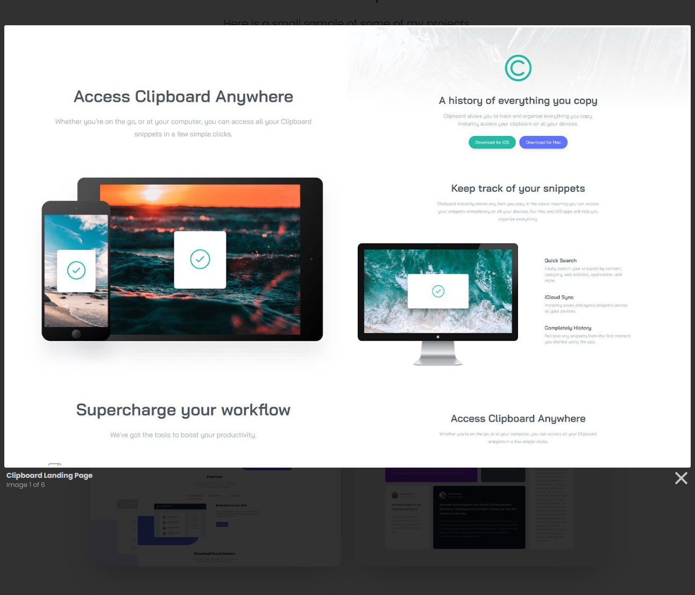

# Projects & Lightbox

In this lesson, we will add the projects section and a lightbox for the images. A lightbox is similar to a modal, but it is used for images. We will use a script called [Lightbox2](https://lokeshdhakar.com/projects/lightbox2/). What is really cool about this is when you open the lightbox, you can then scroll through the images.

The Lightbox script and CSS should be included in the `index.html` file. The files are included locally rather than using a CDN.

## Projects Section

Let's start by adding the projects. Add the following code to the `index.html` file:

```html
<!-- Portfolio -->
<section class="portfolio py-5 bg-light">
  <div class="container">
    <div class="text-center mb-5">
      <h4 class="text-uppercase fw-bold text-primary">Portfolio</h4>
      <hr class="w-25 mx-auto" />

      <h2 class="mb-4">Check Out My Work</h2>
      <p class="lead">Here is a small sample of some of my projects.</p>
    </div>

    <div class="row">
      <div class="col-md-6 mb-4">
        <div class="project shadow-lg rounded-5">
          <a
            href="images/project1.jpg"
            data-lightbox="images"
            data-title="Clipboard Landing Page"
          >
            
          </a>
        </div>
      </div>
      <div class="col-md-6 mb-4">
        <div class="project shadow-lg rounded-5">
          <a
            href="images/project2.jpg"
            data-lightbox="images"
            data-title="Loop Studios Website"
          >
            
          </a>
        </div>
      </div>
    </div>
    <div class="row">
      <div class="col-md-6 mb-4">
        <div class="project shadow-lg rounded-5">
          <a
            href="images/project3.jpg"
            data-lightbox="images"
            data-title="Shortly Website"
          >
            
          </a>
        </div>
      </div>
      <div class="col-md-6 mb-4">
        <div class="project shadow-lg rounded-5">
          <a
            href="images/project4.jpg"
            data-lightbox="images"
            data-title="Flyo Website"
          >
            
          </a>
        </div>
      </div>
    </div>
    <div class="row">
      <div class="col-md-6 mb-4">
        <div class="project shadow-lg rounded-5">
          <a
            href="images/project5.jpg"
            data-lightbox="images"
            data-title="Bookmark Website"
          >
            
          </a>
        </div>
      </div>
      <div class="col-md-6 mb-4">
        <div class="project shadow-lg rounded-5">
          <a
            href="images/project6.jpg"
            data-lightbox="images"
            data-title="Grid Layout"
          >
            
          </a>
        </div>
      </div>
    </div>
  </div>
</section>
```

We have created 2 rows of images. Notice that we have added the `data-lightbox` and `data-title` attributes to the anchor tags. The `data-lightbox` attribute is used to group the images together. The `data-title` attribute is used to add a title to the image. The title will appear at the bottom of the lightbox.

I also want a little hover effect that scales the image. Add this to the `scss/styles.scss` file:

```scss
.project:hover {
  transform: scale(1.05);
  transition: all 0.5s ease-in-out;
  opacity: 0.8;
}
```

That's it now you should be able to click on a project and it will open the lightbox. You can also scroll through the images.


