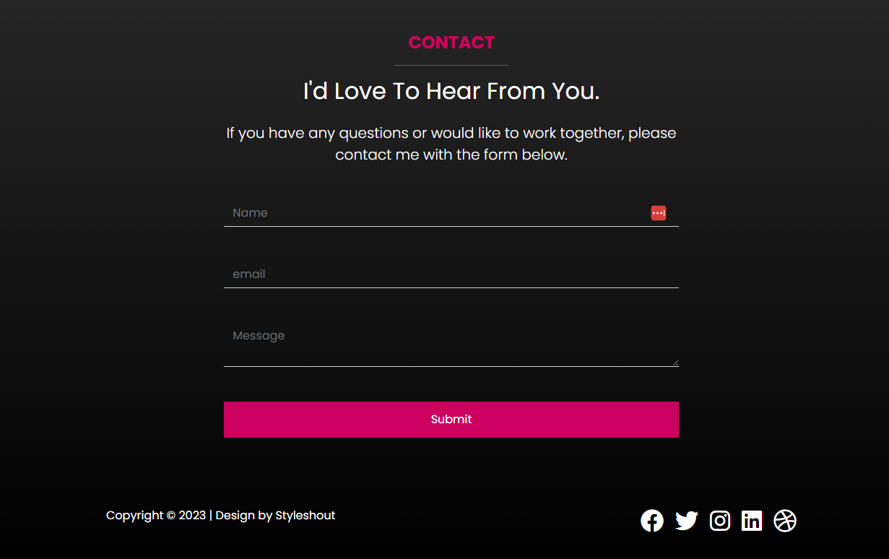

# Stats, Form & Footer

For the final part of this project, we will add the stats setion, the form and the footer.

## Stats Section

The stats will be a row with 6 columns on large screens, 3 columns on medium screens and stacked on small screens. If you want to add some JS to make the stats count up like we did in the Yavin website, you can do that. We will just add the HTML and CSS for now. Add the following code to the `index.html` file:

```html
<!-- Stats -->
<section class="stats py-5 text-bg-secondary">
  <div class="container">
    <div class="row g-0">
      <div class="col-md-4 col-lg-2">
        <div class="stat text-center border-end border-dark">
          <i class="fas fa-users fa-3x mb-3"></i>
          <p class="fs-1">500+</p>
          <h3 class="fs-6 text-uppercase">Clients</h3>
        </div>
      </div>
      <div class="col-md-4 col-lg-2">
        <div class="stat text-center border-end border-dark"
          <i class="fas fa-project-diagram fa-3x mb-3"></i>
          <p class="fs-1">700+</p>
          <h3 class="fs-6 text-uppercase">Projects</h3>
        </div>
      </div>
      <div class="col-md-4 col-lg-2">
        <div class="stat text-center border-end border-dark">
          <i class="fas fa-clock fa-3x mb-3"></i>
          <p class="fs-1">16+</p>
          <h3 class="fs-6 text-uppercase">Years</h3>
        </div>
      </div>
      <div class="col-md-4 col-lg-2">
        <div class="stat text-center border-end border-dark">
          <i class="fas fa-book fa-3x mb-3"></i>
          <p class="fs-1">25</p>
          <h3 class="fs-6 text-uppercase">Publications</h3>
        </div>
      </div>
      <div class="col-md-4 col-lg-2">
        <div class="stat text-center border-end border-dark">
          <i class="fab fa-youtube fa-3x mb-3"></i>
          <p class="fs-1">2.06M</p>
          <h3 class="fs-6 text-uppercase">Subscribers</h3>
        </div>
      </div>
      <div class="col-md-4 col-lg-2">
        <div class="stat text-center border-end border-dark">
          <i class="fas fa-graduation-cap fa-3x mb-3"></i>
          <p class="fs-1">1M+</p>
          <h3 class="fs-6 text-uppercase">Students</h3>
        </div>
      </div>
    </div>
  </div>
</section>
```

We added a border on the right of each column to separate them. On small screens, I don't want this. I actually want a border on the bottom. Let's add the following to the `scss/styles.scss` file:

```scss
@media (max-width: 767px) {
  // ...

  .stats .stat {
    border-right: 0 !important;
    margin-bottom: 40px;
    border-bottom: #333 solid 1px;
    padding-bottom: 20px;
  }
}
```

## Form

Add the following code to the `index.html` file:

```html
<!-- Contact -->
<section class="contact text-bg-dark bg-gradient py-5">
  <div class="container">
    <div class="row">
      <div class="col-md-8 offset-md-2">
        <div class="text-center mb-5">
          <h4 class="text-uppercase fw-bold text-primary">Contact</h4>
          <hr class="w-25 mx-auto" />

          <h2 class="mb-4">I'd Love To Hear From You.</h2>
          <p class="lead">
            If you have any questions or would like to work together, please
            contact me with the form below.
          </p>
        </div>
        <form>
          <div class="mb-5">
            <input
              type="text"
              class="form-control bg-transparent border-top-0 border-start-0 border-end-0 rounded-0 border-muted text-white"
              placeholder="Name"
            />
          </div>
          <div class="mb-5">
            <input
              type="email"
              class="form-control bg-transparent border-top-0 border-start-0 border-end-0 rounded-0 border-muted text-white"
              placeholder="email"
            />
          </div>
          <div class="mb-5">
            <textarea
              class="form-control bg-transparent border-top-0 border-start-0 border-end-0 rounded-0 border-muted text-white"
              placeholder="Message"
            ></textarea>
          </div>
          <div class="mb-5 d-grid">
            <button type="submit" class="btn btn-primary">Submit</button>
          </div>
        </form>
      </div>
    </div>

    <!-- Footer Area -->
  </div>
</section>
```

We created a form and added border classes so that only the bottom border shows. We also added a gradient background. I put a comment in the code where the footer will go. I want it in the same section with the gradient, so this is where we will put the following code:

```html
<!-- Footer Area -->
<div class="d-flex mt-5">
  <p class="flex-grow-1">Copyright &copy; 2023 | Design by Styleshout</p>
  <div class="hstack gap-3">
    <a class="text-decoration-none" href="#">
      <i class="fab fa-facebook fa-2x text-white"></i>
    </a>
    <a class="text-decoration-none" href="#">
      <i class="fab fa-twitter fa-2x text-white"></i>
    </a>
    <a class="text-decoration-none" href="#">
      <i class="fab fa-instagram fa-2x text-white"></i>
    </a>
    <a class="text-decoration-none" href="#">
      <i class="fab fa-linkedin fa-2x text-white"></i>
    </a>
    <a class="text-decoration-none" href="#">
      <i class="fab fa-dribbble fa-2x text-white"></i>
    </a>
  </div>
</div>
```

We used `d-flex` and I added a class of `flex-grow-1` to the paragraph so that it will take up all the space on the left. We also used `hstack` to stack the icons horizontally. We used `gap-3` to add a gap between the icons.



That's it! congrats on finishing the project!
