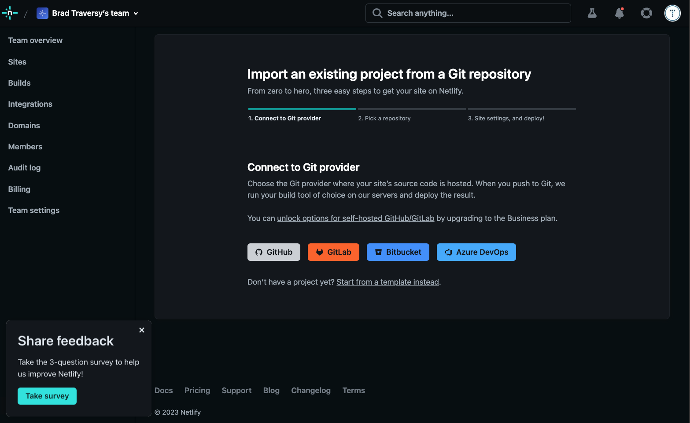

# Deploy To Netlify & Form Submissions

In this lesson we will deploy our portfolio website to Netlify. Netlify also has a form submission service.

## Push To Github

We will first need to push to Github. If you don't have an account, create on now. Once you have an account, create a new repository. You can name it whatever you want. I am going to name mine `portfolio-website`. Make sure you do not initialize with a README. We already have one. Once you create the repo, you will see some instructions on how to push your code to Github. Let's do that now. You can do this using VS Code or via the terminal. I am going to do it via the terminal in case some of you are not using VS Code.

Open your terminal and type the following commands:

```bash
git init
git add .
git commit -m "Initial Commit"
```

First we initialized a git repository. Then we added all of our files to the staging area. Then we committed them to the repo. Now we need to add the remote repo and push our code to it. You should see the instructions on how to do this in the Github repo you created. It should look something like this:

```bash
  git remote add origin https://github.com/youraccount/portfolio-website.git   #(This will be your own repo/account)
  git branch -M main
  git push -u origin main
```

Now your code is pushed to Github. Let's move on to Netlify.

## Netlify

Sign up to Netlify using your Github account. Once you log in, click `Add New Site` then `Import Existing Project`


Then choose `GitHub`



Then you should see a list of your repos. You can search for the one that you want to deploy.


 Select the portfolio.


In the options, add the build command 

```bash
npm run sass:build
```


It will run this on the server, creating the css files.

Now click deploy. It may take about a minute or so. Then you will see a screen like this.


Click on the url and it will take you to your website.

## Form

To make the form work, click on `Forms` in the left sidebar. Click on `Enable Forms`.


Now edit your form's HTML. Add a name attribute to the fields and form and add the `netlify` attribute to the form. It will look like this.

```html
<form name="contact" netlify>
    <div class="mb-5">
     <input
      type="text"
       class="form-control bg-transparent border-top-0 border-start-0 border-end-0 rounded-0 border-muted text-white"
       name="name"
       placeholder="Name"
     />
    </div>
    <div class="mb-5">
     <input
      type="email"
       class="form-control bg-transparent border-top-0 border-start-0 border-end-0 rounded-0 border-muted text-white"
        name="email"
       placeholder="Email"
      />
       </div>
      <div class="mb-5">
       <textarea
         class="form-control bg-transparent border-top-0 border-start-0 border-end-0 rounded-0 border-muted text-white"
         name="message"
         placeholder="Message"
        ></textarea>
       </div>
       <div class="mb-5 d-grid">
           <button type="submit" class="btn btn-primary">Submit</button>
      </div>
  </form>
```

Push to github again

```bash
git add .
git commit -m 'Added form attributes'
git push
```

Netlify will automatically deploy the changes.

Now try and submit your form. You should see a thank you message and a link to go back.


To check your submissions, click on `Site Overview` and you will see an area with your form submissions.


