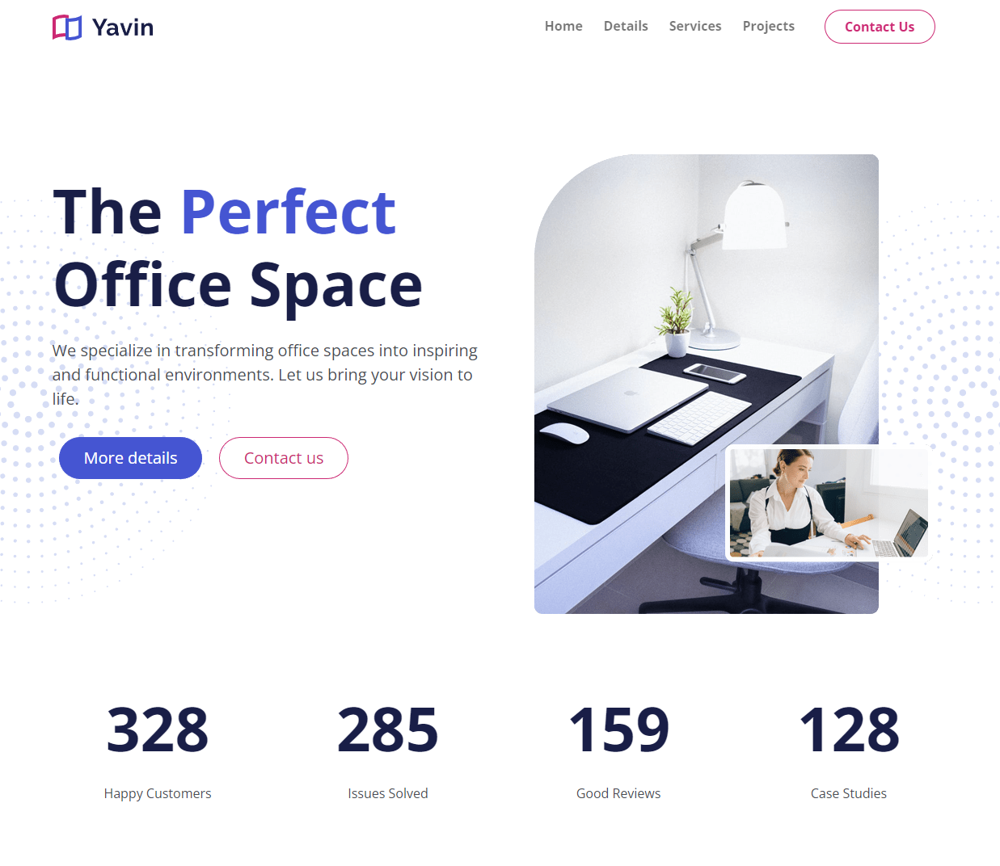

# Project Intro & Setup

This is a website for a business that creates and customizes office spaces. Here are the main features:

- Clean design with background images/patterns
- Responsive design
- Custom JavaScript for the stat counter
- Nav scroll effect
- Project area
- Testimonial slider/carousel
- Contact form
- Inner article page
- Font awesome icons



# Project Setup

We will be using Sass to compile our CSS. I have included a zip file called `yavin-website-starter`. Download that file, extract it and rename it to `yavin-website`. This will be our starting point for this project.

## What is Included in the Starter?

- The `bs5-simple-starter` files
- The `Open Sans` font from Google Fonts
- Website images
- Website favicon

## Install Dependencies

Open a terminal in the root of the project and run the following command to install the dependencies:

```bash
npm install
```

## Sass

We will need to compile our Sass. Run the following command whenever you are working on the project:

```bash
npm run sass:watch
```

Now you can make changes to the `scss/bootstrap.scss` and `scss/styles.scss` files and they will compile to css.

## Open in Browser

If you are using VS Code, I would suggest using the [Live Server](https://marketplace.visualstudio.com/items?itemName=ritwickdey.LiveServer) extension to open the project in your browser. If you are not using VS Code, you can just open the `index.html` file in your browser.

## Bootstrap Variables

We will be adding some custom variables in the `scss/bootstrap.scss` file. Open that file and add the following to the top of the file:

```scss
// Font
$font-family-sans-serif: 'Open Sans', sans-serif;
$headings-font-weight: bold;

// Colors
$primary: #4555d2;
$secondary: #cc2973;
$dark: #191e47;
$light: #f9fafe;
$body-color: #494c52;
$headings-color: $dark;

// Navbar
$navbar-nav-link-padding-x: 0.8rem;
$navbar-padding-y: 1rem;
$nav-link-font-weight: 700;

// Spacing
$spacer: 1rem !default;
$spacers: (
  0: 0,
  1: $spacer * 0.25,
  2: $spacer * 0.5,
  3: $spacer,
  4: $spacer * 1.5,
  5: $spacer * 3,
  6: $spacer * 6,
  7: $spacer * 8,
  8: $spacer * 12,
) !default;

$headings-margin-bottom: $spacer * 1 !default;
$line-height-base: 1.7;

// Buttons
$button-radius: 50px;
$button-padding-x: 30px;
$button-padding-y: 10px;

$btn-border-radius: $button-radius;
$btn-border-radius-sm: $button-radius;
$btn-border-radius-lg: $button-radius;
$btn-padding-y: $button-padding-y;
$btn-padding-y-lg: $button-padding-y;
$btn-padding-y-sm: $button-padding-y;
$btn-padding-x: $button-padding-x;
$btn-padding-x-lg: $button-padding-x;
$btn-padding-x-sm: $button-padding-x;
$navbar-toggler-border-radius: 5px;

// Inputs
$input-radius: 30px;
$input-btn-padding-y: 0.7rem;
$input-btn-padding-x: 1rem;
$input-border-radius: $input-radius;
$input-border-radius-sm: $input-radius;
$input-border-radius-lg: $input-radius;

@import '../node_modules/bootstrap/scss/bootstrap';
```

Most of this is pretty self explanatory. We used a lot of it in the previous project. We added some variables for input spacing and border radius.
