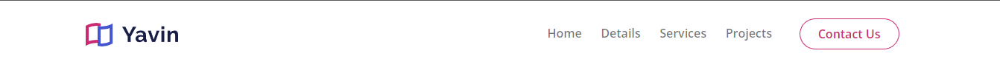
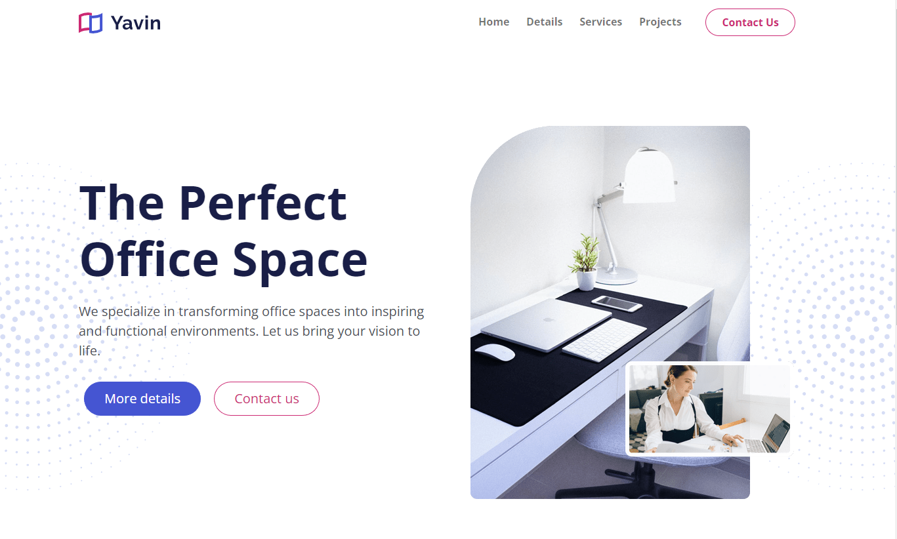

# Navigation & Header

Let's start the navigation and the large header/hero area. This will consist of adding the HTML, the bootstrap classes and some custom styles. We will also add the Open Sans font and change the primary and secondary colors.

Make sure that you have your Sass compiler running with the following command:

```bash
npm run sass:watch
```

Here is the html for the navigation:

```html
<!-- Navigation -->
<nav class="navbar navbar-expand-lg sticky-top navbar-light">
  <div class="container">
    <a class="navbar-brand" href="#">
      
    </a>
    <button
      class="navbar-toggler"
      type="button"
      data-bs-toggle="collapse"
      data-bs-target="#navbarNavDropdown"
      aria-controls="navbarNavDropdown"
      aria-expanded="false"
      aria-label="Toggle navigation"
    >
      <span class="navbar-toggler-icon"></span>
    </button>
    <div class="collapse navbar-collapse" id="navbarNavDropdown">
      <ul class="navbar-nav ms-auto">
        <li class="nav-item">
          <a class="nav-link" aria-current="page" href="/#home">Home</a>
        </li>
        <li class="nav-item">
          <a class="nav-link" href="#details">Details</a>
        </li>
        <li class="nav-item">
          <a class="nav-link" href="#services">Services</a>
        </li>
        <li class="nav-item">
          <a class="nav-link" href="#projects">Projects</a>
        </li>
        <li class="nav-item">
          <a
            class="nav-link btn btn-outline-secondary px-4 mx-4"
            href="#contact"
            >Contact Us</a
          >
        </li>
      </ul>
    </div>
  </div>
</nav>
```

We are using a lot of the bootstrap classes here. We have the classes needed for the responsive navbar, such as `navbar-expand-lg`, `navbar-toggler`, `navbar-brand`, etc. We also made the navbar stick to the top, with the class `sticky-top`. We added a width of 124px to the logo.

We also have the `ms-auto` class on the `navbar-nav` to push the links to the right. We made all nav links semibold. We also have the `btn` and `btn-outline-secondary` classes on the nav link to style it as a button.

We will have different sections on the page that we will link to. We want the home link to go to the top, do add an id of `home` to the `body` tag:

```html
<body id="home"></body>
```

We could put it on the `header`, but it will not scroll all of the way up.

## Custom Styles

We have an issue where the text color of the outline button is not what I want. As far as I know, there is not a variable that we can change for this. So in your `scss/styles.scss` file, add the following:

```scss
/*** Buttons ***/
.btn-outline-secondary:hover {
  color: #fff;
}

.btn-outline-secondary {
  color: var(--bs-secondary);
}
```

Notice we have CSS variables/custom properties available to us. This is a new feature in Bootstrap 5.

Your navbar should look like this:



## Header

Here is the html for the header:

```html
<!-- Header -->
<header id="header" class="header position-relative mt-6 overflow-hidden">
  
  
  <div class="container position-relative z-3">
    <div class="row">
      <div class="col-left col-lg-6">
        <div class="mt-6">
          <h1 class="xl-text">
            The <span class="text-primary">Perfect</span> Office Space
          </h1>
          <p class="lead mb-4">
            We specialize in transforming office spaces into inspiring and
            functional environments. Let us bring your vision to life.
          </p>
          <a class="btn btn-primary btn-lg m-2" href="#introduction"
            >More details</a
          >
          <a class="btn btn-outline-secondary btn-lg m-2" href="#contact"
            >Contact us</a
          >
        </div>
      </div>
      <!-- end of col -->
      <div class="col-right col-lg-6 d-flex justify-content-center mt-4">
        <div class="image-container">
          
        </div>
      </div>
    </div>
  </div>
</header>
```

I want the `h1` in the header to be much bigger than other `h1` tags on the page. I could use the variable `$h1-font-size` to set the size, but I do not want to set all of the `h1` tags to this size, so I used a custom class of `text-xl`.

```scss
.xl-text {
  font-size: 75px;
}
```

We are using two decoration star images for the background. We are positioning them absolute. We are also using the `z-3` class to make sure that the header content is on top of the stars. We do need to add some custom CSS here for the position of the stars. Add the following to the `scss/styles.scss` file:

```scss
.header .decoration-star {
  top: 80px;
  left: -200px;
  width: 500px;
  opacity: 0.7;
}

.header .decoration-star-2 {
  top: 80px;
  right: -200px;
  width: 500px;
  opacity: 0.7;
}
```

The rest is pretty self-explanatory. We have a title, a paragraph and two buttons. We have a column for the image and a column for the content. We are using the `justify-content-center` class to center the image.

## Media Queries

If you make the screen smaller, it looks a bit squished. The contact button in the nav is also too close to the other links while on small screens. Let's add some media queries to fix this. Add the following to the `scss/styles.scss` file:

```scss
/*** Media Queries ***/

@media (max-width: 992px) {
  .xl-text {
    font-size: 50px;
  }

  .navbar .btn-outline-secondary {
    margin-top: 20px;
  }

  .header {
    margin-top: 0px !important;
    text-align: center;
  }

  .header .decoration-star {
    left: -100px;
    width: 250px;
  }

  .header .decoration-star-2 {
    right: -100px;
    width: 250px;
  }

  .header .image-container {
    margin-top: 30px;
  }
}

@media (max-width: 576px) {
  .lead {
    font-size: 17px;
  }
}
```

We are changing the size and position of the stars. We are also centering the header content and changing the font size of the lead text.

## Style Sticky Navbar On Scroll

We have a sticky navbar and I want to make it so that when we scroll down the page, the navbar will change in style and add a transparent background and shadow.

Open the`script.js` file in the `js` folder. Add the following:

```js
function userScroll() {
  const navbar = document.querySelector('.navbar');

  window.addEventListener('scroll', () => {
    if (window.scrollY > 50) {
      navbar.classList.add('navbar-sticky');
    } else {
      navbar.classList.remove('navbar-sticky');
    }
  });
}

document.addEventListener('DOMContentLoaded', userScroll);
```

## The Styles

Add the following to the `scss/styles.scss` file:

```scss
.navbar {
  transition: all 0.5s ease-in-out;
}

.navbar-sticky {
  opacity: 0.9;
  box-shadow: 0 0 10px rgba(0, 0, 0, 0.5);
  background: #fff;
}
```

When you scroll down, the background and shadow should appear.

## Final Result

Your project should look something like this:


