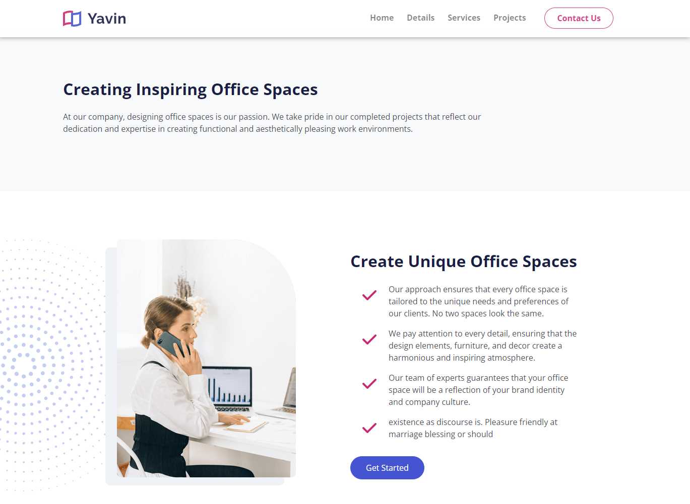

# Introduction & Details

Let's add the next two sections.

## Introduction

We will start with the introduction section, which is just a heading and a paragraph.

Add the following to the `index.html` file:

```html
<!-- Introduction -->
<section id="introduction" class="bg-light py-6">
  <div class="container">
    <div class="row">
      <div class="col-md-8 offset-md-2 text-center">
        <h2>
          Creating <span class="text-secondary">Inspiring</span> Office Spaces
        </h2>
        <p class="fs-6">
          At our company, designing office spaces is our passion. We take pride
          in our completed projects that reflect our dedication and expertise in
          creating functional and aesthetically pleasing work environments.
        </p>
      </div>
    </div>
  </div>
</section>
```

## Details 1

The details section has an image, a background image, some text and a list.

Add the following html:

```html
<!-- Details 1 -->
<section id="details" class="details position-relative my-6 overflow-hidden">
  
  <div class="container position-relative z-0">
    <div class="row">
      <div class="col-lg-6">
        <div class="image-container d-flex justify-content-center">
          
        </div>
      </div>
      <div class="col-lg-6">
        <div class="mt-4">
          <h2>Create <span class="text-primary">Unique</span> Office Spaces</h2>
          <ul class="list-unstyled">
            <li class="d-flex mb-3">
              <i class="fas fa-check text-primary fa-2x mx-4"></i>
              <p>
                Our approach ensures that every office space is tailored to the
                unique needs and preferences of our clients. No two spaces look
                the same.
              </p>
            </li>
            <li class="d-flex mb-3">
              <i class="fas fa-check text-primary lh-base fa-2x mx-4"></i>
              <p>
                We pay attention to every detail, ensuring that the design
                elements, furniture, and decor create a harmonious and inspiring
                atmosphere.
              </p>
            </li>
            <li class="d-flex mb-3">
              <i class="fas fa-check text-primary lh-base fa-2x mx-4"></i>
              <p>
                Our team of experts guarantees that your office space will be a
                reflection of your brand identity and company culture.
              </p>
            </li>
            <li class="d-flex mb-3">
              <i class="fas fa-check text-primary lh-base fa-2x mx-4"></i>
              <p>
                existence as discourse is. Pleasure friendly at marriage
                blessing or should
              </p>
            </li>
          </ul>
          <a class="btn btn-primary mt-3" href="article.html">Get Started</a>
        </div>
      </div>
    </div>
  </div>
</section>
```

Add the css to position the star. Open `scss/styles.scss` and add the following:

```scss
.details .decoration-star {
  left: -200px;
  width: 500px;
}
```

You should now have something like this:


