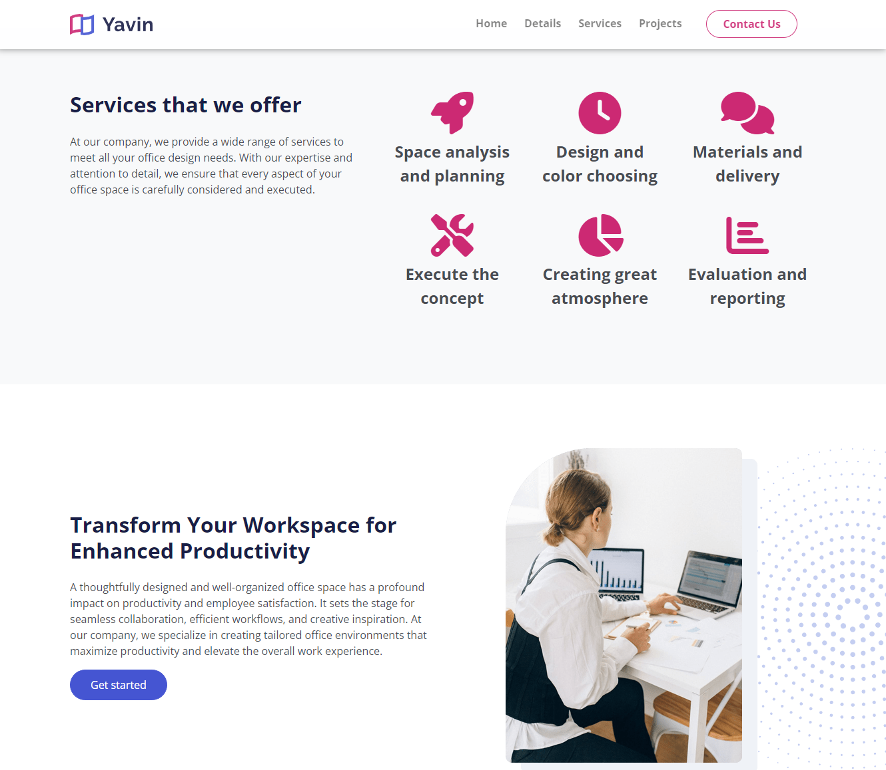
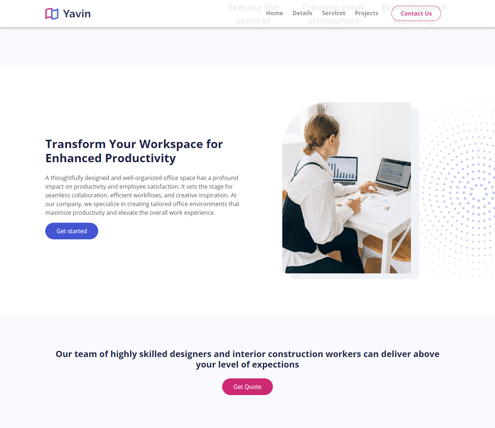

# 3 Middle Sections

Now we will create 3 more sections on our website. Let's add the services area.

## Services

Add the following html section:

```html
<!-- Services -->
<section id="services" class="services cards-1 bg-light py-6">
  <div class="container">
    <div class="row">
      <div class="col-lg-5">
        <div class="text-container">
          <h2><span class="text-secondary">Services</span> that we offer</h2>
          <p>
            At our company, we provide a wide range of services to meet all your
            office design needs. With our expertise and attention to detail, we
            ensure that every aspect of your office space is carefully
            considered and executed.
          </p>
        </div>
      </div>
      <div class="col-lg-7">
        <div class="row mb-4">
          <div
            class="col-md-4 d-flex flex-column align-items-center text-center"
          >
            <span class="fas fa-rocket text-secondary fa-4x mb-2"></span>
            <p class="fs-5 fw-bold">Space analysis and planning</p>
          </div>
          <div
            class="col-md-4 d-flex flex-column align-items-center text-center"
          >
            <span class="fas fa-clock text-secondary fa-4x mb-2"></span>
            <p class="fs-5 fw-bold">Design and color choosing</p>
          </div>
          <div
            class="col-md-4 d-flex flex-column align-items-center text-center"
          >
            <span class="fas fa-comments text-secondary fa-4x mb-2"></span>
            <p class="fs-5 fw-bold">Materials and delivery</p>
          </div>
        </div>
        <div class="row">
          <div
            class="col-md-4 d-flex flex-column align-items-center text-center"
          >
            <span class="fas fa-tools text-secondary fa-4x mb-2"></span>
            <p class="fs-5 fw-bold">Execute the concept</p>
          </div>
          <div
            class="col-md-4 d-flex flex-column align-items-center text-center"
          >
            <span class="fas fa-chart-pie text-secondary fa-4x mb-2"></span>
            <p class="fs-5 fw-bold">Creating great atmosphere</p>
          </div>
          <div
            class="col-md-4 d-flex flex-column align-items-center text-center"
          >
            <span class="fas fa-chart-bar text-secondary fa-4x mb-2"></span>
            <p class="fs-5 fw-bold">Evaluation and reporting</p>
          </div>
        </div>
      </div>
    </div>
  </div>
</section>
```

We have some font-awesome icons and some text. The text is divided into 2 columns. The first column has a title and a paragraph. The second column has 2 rows. Each row has 3 columns. Each column has an icon and some text.

If you make the screen small, the icons look kind of squished together. I am going to add a border to the bottom on smaller screens to separate them out a bit. Add the following media query:

```css
@media (max-width: 992px) {
  //...

  .services .col-md-4 {
    border-bottom: 1px #ccc solid;
    margin: 7px 0;
  }
}
```

## Details 2

We have another details section. Add the following html:

```html
<!-- Details 2 -->
<section class="details-2 position-relative my-6 overflow-hidden">
  
  <div class="container position-relative z-3">
    <div class="row">
      <div class="col-lg-6 col-xl-6">
        <div class="mt-6">
          <h2>
            Transform Your Workspace for Enhanced
            <span class="text-primary">Productivity</span>
          </h2>
          <p>
            A thoughtfully designed and well-organized office space has a
            profound impact on productivity and employee satisfaction. It sets
            the stage for seamless collaboration, efficient workflows, and
            creative inspiration. At our company, we specialize in creating
            tailored office environments that maximize productivity and elevate
            the overall work experience.
          </p>
          <a class="btn btn-primary" href="article.html">Get started</a>
        </div>
      </div>
      <div class="col-lg-6 col-xl-6">
        <div class="image-container d-flex justify-content-center">
          
        </div>
      </div>
    </div>
  </div>
</section>
```

This is very similar to details 1, it is just the opposite layout.

Add the positioning of the background image:

```scss
.details-2 .decoration-star {
  right: -200px;
  width: 500px;
}

```

Add the following media queries:

```css
/*** Media Queries ***/

@media (max-width: 992px) {
  .details-2 {
    margin-top: 0 !important;
  }

  .details-2 .image-container {
    margin-top: 30px;
  }

  .details-2 .decoration-star {
    top: 300px;
    right: -200px;
    width: 500px;
  }
}
```

Your page should look like this:



## Get Quote

This is a really simple section, it is just some text and a button with a light background. Add the following html:

```html
<!-- Invitation -->
<section class="invitation bg-light py-6 text-center">
  <div class="container">
    <div class="row">
      <div class="col-lg-8 offset-lg-2">
        <h4>
          Our team of highly skilled designers and interior construction workers
          can deliver above your level of expections
        </h4>
        <a class="btn btn-secondary" href="#contact">Get Quote</a>
      </div>
    </div>
  </div>
</section>
```

It should look like this:


