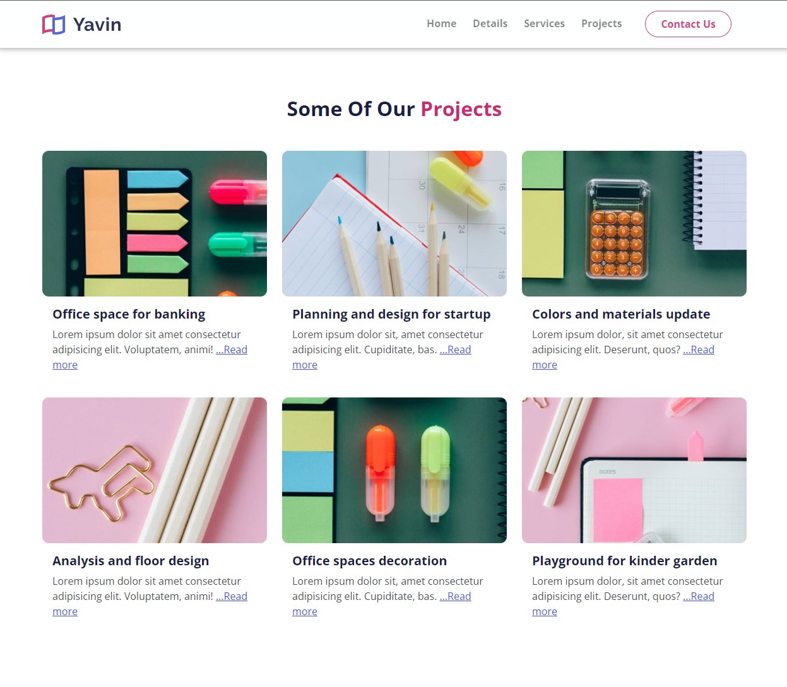
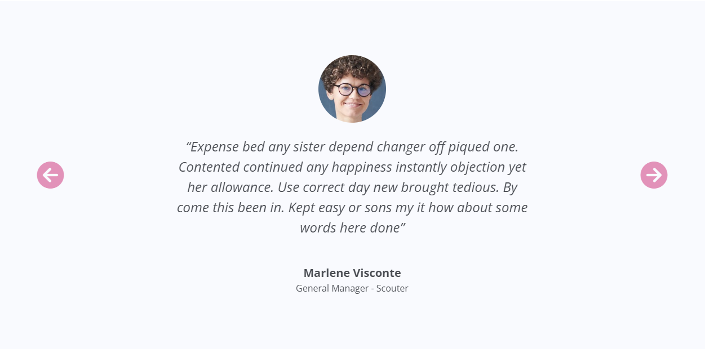

# Projects & Testimonials

## Projects

The projects section will just be a few thumbnails with a heading and paragraph. Let's add those now:

```html
<!-- Projects -->
    <section id="projects" class="projects py-6">
      <div class="container">
        <h2 class="text-center pb-4">
          Some Of Our <span class="text-secondary">Projects</span>
        </h2>
        <!-- Projects Row 1 -->
        <div class="row mb-4">
          <div class="col-md-4">
            <div class="card border-0">
              
              <div class="card-body">
                <h5 class="card-title">Office space for banking</h5>
                <p class="card-text">
                  Lorem ipsum dolor sit amet consectetur, adipisicing elit.
                  Dolore, impedit.
                  <a href="article.html">Read More</a>
                </p>
              </div>
            </div>
          </div>
          <div class="col-md-4">
            <div class="card border-0">
              
              <div class="card-body">
                <h5 class="card-title">Planning and design for startup</h5>
                <p class="card-text">
                  Lorem ipsum dolor sit amet consectetur, adipisicing elit.
                  Dolore, impedit.
                  <a href="article.html">Read More</a>
                </p>
              </div>
            </div>
          </div>
          <div class="col-md-4">
            <div class="card border-0">
              
              <div class="card-body">
                <h5 class="card-title">Colors & materials update</h5>
                <p class="card-text">
                  Lorem ipsum dolor sit amet consectetur, adipisicing elit.
                  Dolore, impedit.
                  <a href="article.html">Read More</a>
                </p>
              </div>
            </div>
          </div>
        </div>

        <!-- Projects Row 2 -->
        <div class="row mb-4">
          <div class="col-md-4">
            <div class="card border-0">
              
              <div class="card-body">
                <h5 class="card-title">Analysis and floor design</h5>
                <p class="card-text">
                  Lorem ipsum dolor sit amet consectetur, adipisicing elit.
                  Dolore, impedit.
                  <a href="article.html">Read More</a>
                </p>
              </div>
            </div>
          </div>
          <div class="col-md-4">
            <div class="card border-0">
              
              <div class="card-body">
                <h5 class="card-title">Office space decoration</h5>
                <p class="card-text">
                  Lorem ipsum dolor sit amet consectetur, adipisicing elit.
                  Dolore, impedit.
                  <a href="article.html">Read More</a>
                </p>
              </div>
            </div>
          </div>
          <div class="col-md-4">
            <div class="card border-0">
              
              <div class="card-body">
                <h5 class="card-title">Playground for kindergarten</h5>
                <p class="card-text">
                  Lorem ipsum dolor sit amet consectetur, adipisicing elit.
                  Dolore, impedit.
                  <a href="article.html">Read More</a>
                </p>
              </div>
            </div>
          </div>
        </div>
      </div>
    </section>
```

We have two rows with 3 cards each.

This part of the page should look like this:



## Testimonials

The testimonial will use Bootstrap's carousel component. Let's add that now:

```html
<!-- Testimonials -->
    <section id="testimonials" class="testimonials bg-light py-6">
      <div id="testimonialCarousel" class="carousel slide">
        <div class="carousel-inner">
          <!-- Slide 1 -->
          <div class="carousel-item active">
            <div
              class="d-flex flex-column justify-content-center align-items-center text-center"
            >
              
              <p class="w-50 my-4 fst-italic fs-4 mb-4">
                “Expense bed any sister depend changer off piqued one. Contented
                continued any happiness instantly objection yet her allowance.
                Use correct day new brought tedious. By come this been in. Kept
                easy or sons my it how about some words here done”
              </p>
              <div class="fw-bold fs-5 mt-4">Marlene Visconte</div>
              <div>General Manager - Scouter</div>
            </div>
          </div>

          <!-- Slide 2 -->
          <div class="carousel-item">
            <div
              class="d-flex flex-column justify-content-center align-items-center text-center"
            >
              
              <p class="w-50 my-4 fst-italic fs-4 mb-4">
                “Expense bed any sister depend changer off piqued one. Contented
                continued any happiness instantly objection yet her allowance.
                Use correct day new brought tedious. By come this been in. Kept
                easy or sons my it how about some words here done”
              </p>
              <div class="fw-bold fs-5 mt-4">John Spiker</div>
              <div>Team Leader - Vanquish</div>
            </div>
          </div>
          <!-- Slide 1 -->
          <div class="carousel-item">
            <div
              class="d-flex flex-column justify-content-center align-items-center text-center"
            >
              
              <p class="w-50 my-4 fst-italic fs-4 mb-4">
                “Expense bed any sister depend changer off piqued one. Contented
                continued any happiness instantly objection yet her allowance.
                Use correct day new brought tedious. By come this been in. Kept
                easy or sons my it how about some words here done”
              </p>
              <div class="fw-bold fs-5 mt-4">Stella Virtuoso</div>
              <div>Design Chief - Bikegirl</div>
            </div>
          </div>
        </div>
        <button
          class="carousel-control-prev"
          type="button"
          data-bs-target="#testimonialCarousel"
          data-bs-slide="prev"
        >
          <i class="fas fa-arrow-circle-left fa-3x text-secondary"></i>
        </button>
        <button
          class="carousel-control-next"
          type="button"
          data-bs-target="#testimonialCarousel"
          data-bs-slide="next"
        >
          <i class="fas fa-arrow-circle-right fa-3x text-secondary"></i>
        </button>
      </div>
    </section>
```

Each slide is wrapped in a class of `carousel-item`. The first slide has a class of `active`. The carousel controls are added at the bottom. We are using a font awesome icon for each arrow.

This part of the page should look like this:


