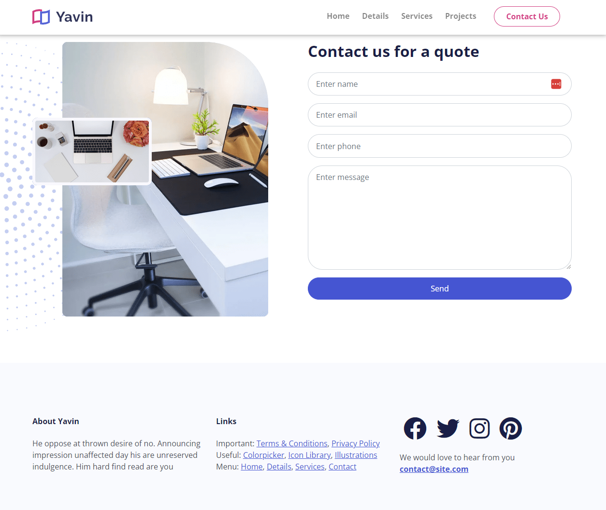

# Contact & Footer

The last two sections of the page are the contact section and the footer. Let's add those now.

## Contact

The contact section consists of an image, the background images and a form.

Add the following html to the `index.html` file:

```html
<!-- Contact -->
<div id="contact" class="contact my-6">
  

  <div class="container position-relative z-3">
    <div class="row">
      <div class="d-none d-md-block col-lg-6">
        <div class="image-container">
          
        </div>
      </div>
      <div class="col-lg-6">
        <div class="text-container">
          <h2>Contact us for a quote</h2>

          <!-- Contact Form -->
          <form>
            <div class="mb-3">
              <input
                type="text"
                class="form-control"
                id="name"
                placeholder="Enter name"
              />
            </div>

            <div class="mb-3">
              <input
                type="email"
                class="form-control"
                id="email"
                placeholder="Enter email"
              />
            </div>

            <div class="mb-3">
              <input
                type="text"
                class="form-control"
                id="phone"
                placeholder="Enter phone"
              />
            </div>

            <div class="mb-3">
              <textarea
                class="form-control"
                placeholder="Enter message"
                id="message"
                rows="8"
              ></textarea>
            </div>

            <div class="d-grid gap-2">
              <input
                type="submit"
                value="Send"
                class="input btn btn-primary btn-block"
              />
            </div>
          </form>
        </div>
      </div>
    </div>
  </div>
</div>
```

I only want the image to display on larger screens, so I added the `d-none d-md-block` classes to the image column. This will hide the image on small screens and display it on medium and larger screens.

We are wrapping each input in a `div` with the `mb-3` class. This will add a margin to the bottom of each input. Each input has a class of `form-control` which will style the input.

We positioned the star background image absolute, so let's add the positioning in the `scss/styles.scss` file:

```scss
.contact .decoration-star {
  left: -300px;
  width: 600px;
}
```

And in the media query, add some margin to the image:

```scss
@media (max-width: 992px) {
  // ...

  .contact .image-container {
    margin-bottom: 50px;
  }
}
```

## Footer & Copyright

The footer is pretty simple. It has 3 columns with some text and social icons.

Add the following html to the `index.html` file:

```html
<footer class="footer bg-light py-6">
      <div class="container">
        <div class="row">
          <div class="col-md-4 my-3">
            <h6>About Yavin</h6>
            <p>
              Lorem ipsum dolor sit, amet consectetur adipisicing elit.
              Molestiae, possimus! Similique asperiores aliquid accusantium
              laudantium.
            </p>
          </div>
          <div class="col-md-4 my-3">
            <h6>Links</h6>
            <ul class="list-unstyled">
              <li>
                Important: <a href="#">Terms & Conditions</a>,
                <a href="#">Privacy Policy</a>
              </li>
              <li>
                Useful: <a href="#">Icon Library</a>,
                <a href="#">Illustrations</a>
              </li>
              <li>
                Menu: <a href="#">Home</a>, <a href="#details">Details</a>,
                <a href="#services">Services</a>, <a href="#contact">Contact</a>
              </li>
            </ul>
          </div>
          <div class="col-md-4 my-3">
            <div class="mb-4">
              <a href="#" class="text-decoration-none">
                <i class="fab fa-facebook fa-3x text-dark mx-2"></i>
              </a>
              <a href="#" class="text-decoration-none">
                <i class="fab fa-twitter fa-3x text-dark mx-2"></i>
              </a>
              <a href="#" class="text-decoration-none">
                <i class="fab fa-instagram fa-3x text-dark mx-2"></i>
              </a>
              <a href="#" class="text-decoration-none">
                <i class="fab fa-pinterest fa-3x text-dark mx-2"></i>
              </a>
            </div>
            <p>
              We would love to hear from you
              <a href="mailto:contact@site.com"
                ><strong>contact@site.com</strong></a
              >
            </p>
          </div>
        </div>
      </div>
    </footer>
```

The bottom of the page should look like this:


