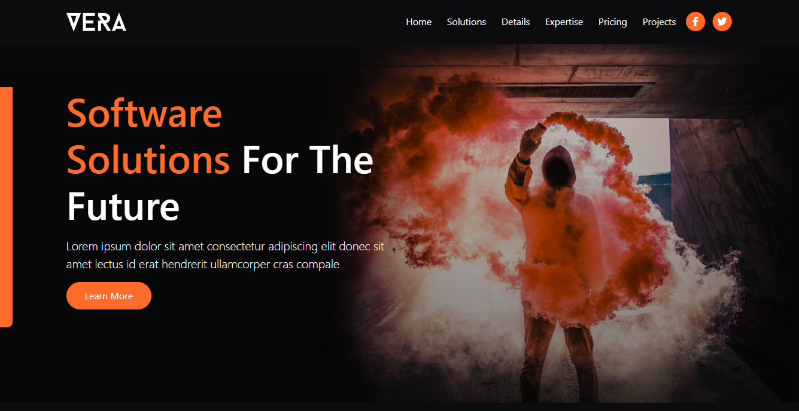

# Navigation & Header

We are going to use a pretty standard navigation and header for our website. The navigation will be a horizontal bar at the top of the page, and the header will be a large area with some text and a backgound image. We will be using a 3rd-party script called `ReplaceMe` that will allow us to have text that rotates between different words. The starter files already includes the script. We just need to add a little bit of JavaScript to initialize it.

## Navigation

Open the `index.html` file and add the following code:

```html
<nav class="navbar navbar-expand-lg sticky-top navbar-dark">
  <div class="container">
    <a class="navbar-brand" href="#">
      
    </a>
    <button
      class="navbar-toggler"
      type="button"
      data-bs-toggle="collapse"
      data-bs-target="#navbarNavDropdown"
      aria-controls="navbarNavDropdown"
      aria-expanded="false"
      aria-label="Toggle navigation"
    >
      <span class="navbar-toggler-icon"></span>
    </button>
    <div class="collapse navbar-collapse" id="navbarNavDropdown">
      <ul class="navbar-nav ms-auto">
        <li class="nav-item">
          <a class="nav-link" aria-current="page" href="#">Home</a>
        </li>
        <li class="nav-item">
          <a class="nav-link" href="#solutions">Solutions</a>
        </li>
        <li class="nav-item">
          <a class="nav-link" href="#details">Details</a>
        </li>
        <li class="nav-item">
          <a class="nav-link" href="#expertise">Expertise</a>
        </li>
        <li class="nav-item">
          <a class="nav-link" href="#pricing">Pricing</a>
        </li>
        <li class="nav-item">
          <a class="nav-link" href="#projects">Projects</a>
        </li>
      </ul>
      <span class="nav-item">
        <span class="fa-stack">
          <a href="https://facebook.com" target="_blank">
            <i class="fas fa-circle fa-stack-2x"></i>
            <i class="fab fa-facebook-f fa-stack-1x text-white"></i>
          </a>
        </span>
        <span class="fa-stack">
          <a href="https://twitter.com" target="_blank">
            <i class="fas fa-circle fa-stack-2x"></i>
            <i class="fab fa-twitter fa-stack-1x text-white"></i>
          </a>
        </span>
      </span>
    </div>
  </div>
</nav>
```

We have a few links and some social icons. We used font awesome's stack feature to put the circle behind the icons. We also used bootstrap's sticky-top class to make the navigation bar stick to the top of the page.

Since the home link goes to `#home`, let's add an id of home to the `body` element.

## Header

For the header, we will be using the `ReplaceMe` script, but we will do that after. For now, add the following code:

```html
<!-- Header -->
<header class="header">
  
  <div class="container">
    <div class="row">
      <div class="col-md-6 pt-5">
        <h1 class="text-xl mt-5">
          Software Solutions For
          <span class="text-primary fw-bold replace-me"
            >Small Business, Startups, Enterprise</span
          >
        </h1>
        <p class="lead">
          Boost your business with cutting-edge software solutions tailored to
          the needs of modern enterprises.
        </p>
        <a href="#" class="btn btn-primary text-white">Learn More</a>
      </div>
    </div>
  </div>
</header>
```

We have a header with a title, some text, and a button inside of a 6 column grid. The reason for that is because the backgound image will be on the right side of the header. I also want the header text to be very large. We have a background decoration that we positioned absolute. Let's add some custom CSS for that.

## Custom Styles

Open the `scss/styles.scss` file and add the following code:

```scss
.xl-text {
  font-size: 65px;
}

.header {
  position: relative;
  background: linear-gradient(rgba(0, 0, 0, 0.2), rgba(0, 0, 0, 0.5)),
    url('../images/header-background.jpg') left center no-repeat;
  background-size: cover;
  height: 600px;
}

.header .vertical-decoration {
  top: 12%;
  width: 24px;
}

@media (max-width: 992px) {
  .xl-text {
    font-size: 50px;
  }

  .header {
    text-align: center !important;
    background: linear-gradient(rgba(0, 0, 0, 0.4), rgba(0, 0, 0, 0.9)),
      url('../images/header-background.jpg') center center no-repeat;
  }
}
```

On smaller screens, I changed the image position and the bightness of the overlay for the background image.

Your page should look like this:



## Replace Me Script

We already have the script included in the `index.html` file. We just need to initialize it. Open the `script.js` file and add the following code:

```js
// Replace Text
const checkReplace = document.querySelector('.replace-me');
if (checkReplace !== null) {
  const replace = new ReplaceMe(document.querySelector('.replace-me'), {
    animation: 'animated fadeIn',
    speed: 2000,
    separator: ',',
    loopCount: 'infinite',
    autoRun: true,
  });
}
```

This will initialize the script and set some options. It will fade in the text, separate the words by a comma, loop infinitely, and run automatically.

Now, you need to add all of the words to the html. In the `header`, change the `h1` to this:

```html
<h1 class="xl-text mt-5">
  Software Solutions For
  <span class="text-primary fw-bold replace-me"
    >Small Business, Startups, Enterprise</span
  >
</h1>
```

Now, it should rotate between the 3 words.
