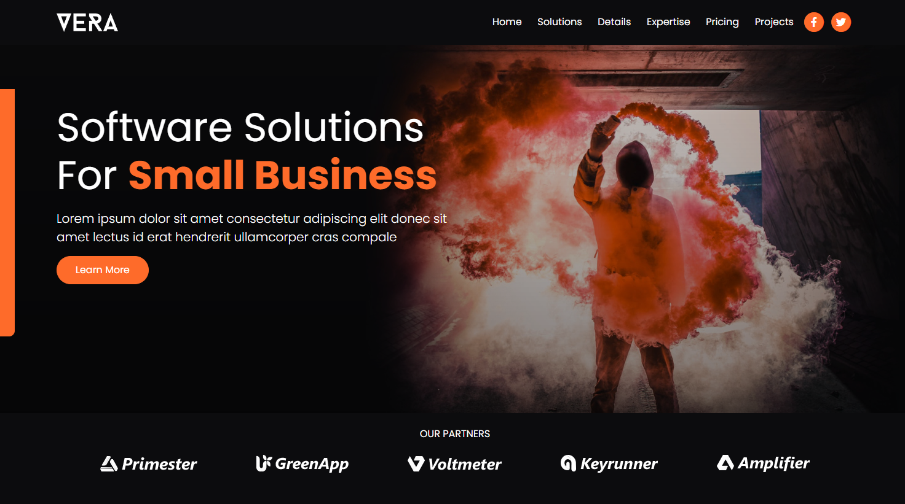
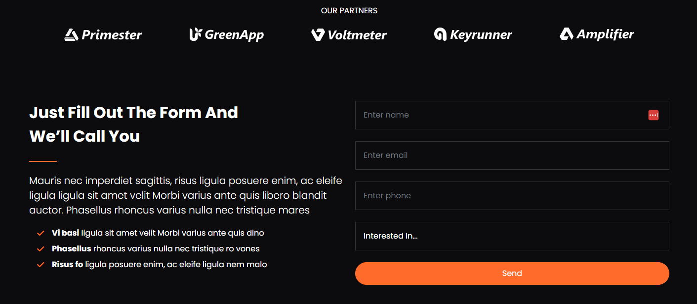

# Partners & Form Sections

We are going to have an area for partner logos under the header and a form section. Let's create that next.

## Partner Logos

We will have all 5 partner logos show on large screens, then 3 on medium screens, and 1 on small screens. I am going to use the `d-flex` class to put them into a horizontal flex box.

Add the following to the bottom of the `index.html` file:

```html
<!-- Partners -->
<section class="partners py-4 overflow-hidden">
  <div class="container">
    <div class="row">
      <div class="col-lg-10 offset-lg-1">
        <h6 class="text-center mb-4 text-uppercase">Our Partners</h6>
        <div
          class="d-flex justify-content-center align-items-center text-center"
        >
          <div>
            
          </div>
          <div class="d-none d-sm-block">
            
          </div>
          <div class="d-none d-md-block">
            
          </div>
          <div class="d-none d-lg-block">
            
          </div>
          <div class="d-none d-lg-block">
            
          </div>
        </div>
      </div>
    </div>
  </div>
</section>
```

The partners section should look like this:



## Contact Form

In the next section, we will have 2 columns. One will have some text and the other will have a form for contact inquiries. We will use the `form-control` class for the form inputs. We also added some variables in the setup lesson for the form input styling.

Add the following to the bottom of the `index.html` file:

```html
<!-- Form Area -->
<section id="contact" class="contact my-7">
  <div class="container">
    <div class="row">
      <div class="col-md-6">
        <h2 class="w-75 fw-bold lh-base">Get More Information</h2>
        <hr class="hr-heading" />
        <p class="lead">
          We provide innovative software solutions that empower businesses to
          thrive in the digital era.
        </p>
        <ul class="list-unstyled lh-lg">
          <li class="d-flex align-items-center">
            <i class="fas fa-check text-primary mx-3"></i>
            <div>
              <strong>Customized Solutions:</strong> Our solutions are designed
              to meet your specific business needs, ensuring maximum efficiency
              and productivity.
            </div>
          </li>
          <li class="d-flex align-items-center">
            <i class="fas fa-check text-primary mx-3"></i>
            <div>
              <strong>Seamless Integration:</strong> We seamlessly integrate our
              software with your existing systems, minimizing disruptions and
              optimizing workflows.
            </div>
          </li>
          <li class="d-flex align-items-center">
            <i class="fas fa-check text-primary mx-3"></i>
            <div>
              <strong>Exceptional Performance:</strong> Our solutions are built
              for performance, reliability, and scalability, ensuring smooth
              operations even during peak loads.
            </div>
          </li>
        </ul>
      </div>
      <div class="col-md-5 offset-lg-1">
        <form>
          <div class="mb-4">
            <input
              type="text"
              class="form-control bg-secondary"
              id="name"
              placeholder="Enter name"
            />
          </div>

          <div class="mb-4">
            <input
              type="email"
              class="form-control bg-secondary"
              id="email"
              placeholder="Enter email"
            />
          </div>

          <div class="mb-4">
            <input
              type="text"
              class="form-control bg-secondary"
              id="phone"
              placeholder="Enter phone"
            />
          </div>

          <div class="mb-4">
            <select id="interested" class="form-control bg-secondary">
              <option>Interested In...</option>
              <option>ERP Solution</option>
              <option>CRM Solution</option>
              <option>CMS Solution</option>
              <option>SFA Solution</option>
              <option>Other</option>
            </select>
          </div>

          <div class="mb-4 form-check">
            <input type="checkbox" id="agree-check" />
            <label class="form-check-label" for="agree-check"
              >I agree to the

              <a href="terms.html">Terms & Conditions</a></label
            >
          </div>

          <div class="d-grid gap-2">
            <input
              type="submit"
              value="Send"
              class="input btn btn-primary btn-block text-white"
            />
          </div>
        </form>
      </div>
    </div>
  </div>
</section>
```

## Custom Styles

We have an `hr` element that we want to style. Add the following to the bottom of the `scss/styles.scss` file:

```scss
.hr-heading {
  display: inline-block;
  width: 3.5rem;
  height: 0.125rem;
  margin-top: 0.625rem;
  border: none;
  background-color: #fe6b2a;
  opacity: 1;
}
```

The page should look like this:


