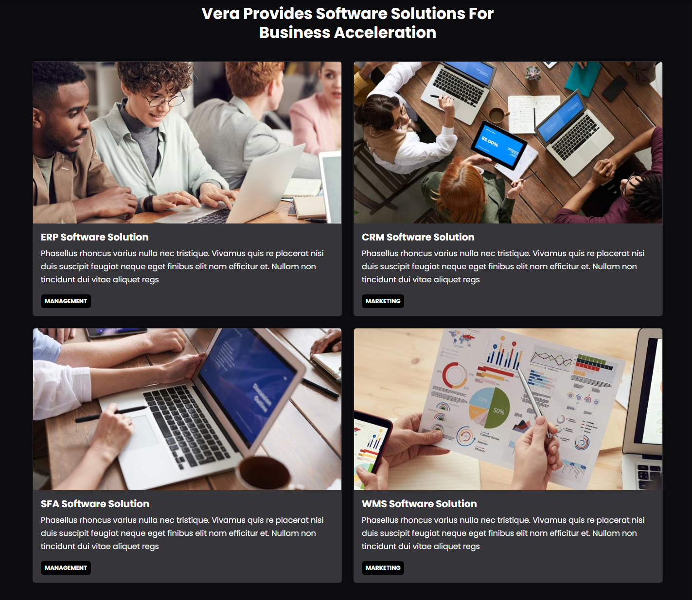

# Solutions, Details & Expertise

We will be working on the nav scroll effect and the solutions area.

Add the following to your `script.js` file:

```js
// User Scroll For Navbar
function userScroll() {
  const navbar = document.querySelector('.navbar');

  window.addEventListener('scroll', () => {
    if (window.scrollY > 50) {
      navbar.classList.add('bg-dark');
      navbar.classList.add('border-bottom');
      navbar.classList.add('border-secondary');
      navbar.classList.add('navbar-sticky');
    } else {
      navbar.classList.remove('bg-dark');
      navbar.classList.remove('border-bottom');
      navbar.classList.remove('border-secondary');
      navbar.classList.remove('navbar-sticky');
    }
  });
}

document.addEventListener('DOMContentLoaded', userScroll);

```

In your `scss/styles.scss` add the following:

```scss
.navbar {
  transition: all 0.5s ease-in-out;
}

.navbar-sticky {
  opacity: 0.9;
}
```

## Solutions

Add the following to the bottom of the `index.html` file:

```html
<!-- Solutions -->
<section id="solutions" class="solutions my-7">
  <div class="container">
    <!-- Heading -->
    <div class="row mb-4">
      <div
        class="col-6 offset-3 d-flex flex-column align-items-center text-center"
      >
        <h5>
          <span class="badge bg-primary rounded-0 text-uppercase"
            >Solutions</span
          >
        </h5>
        <h2 class="fw-bold">
          Vera Provides Software Solutions For Business Acceleration
        </h2>
      </div>
    </div>
    <!-- Solutions Row 1 -->
    <div class="row">
      <div class="col-md-6 mb-4">
        <div class="card bg-secondary">
          
          <div class="card-body">
            <h5 class="card-title fw-bold">ERP Software Solution</h5>
            <p class="card-text">
              Our ERP software solution streamlines your business processes and
              enhances operational efficiency. With integrated modules for
              finance, human resources, and more, you can make data-driven
              decisions.
            </p>
            <div class="badge bg-primary p-2 text-uppercase">Management</div>
          </div>
        </div>
      </div>
      <div class="col-md-6 mb-4">
        <div class="card bg-secondary">
          
          <div class="card-body">
            <h5 class="card-title fw-bold">CRM Software Solution</h5>
            <p class="card-text">
              Our CRM software solution helps you build stronger customer
              relationships and drive sales growth. Manage leads, track
              interactions, and deliver personalized experiences to maximize
              customer satisfaction and loyalty.
            </p>
            <div class="badge bg-dark p-2 text-uppercase">Marketing</div>
          </div>
        </div>
      </div>
    </div>
    <!-- Solutions Row 2 -->
    <div class="row">
      <div class="col-md-6 mb-4">
        <div class="card bg-secondary">
          
          <div class="card-body">
            <h5 class="card-title fw-bold">SFA Software Solution</h5>
            <p class="card-text">
              Our SFA software solution empowers your sales team with the tools
              they need to drive revenue growth. Streamline sales processes,
              track performance, and enhance collaboration to close deals
              faster.
            </p>
            <div class="badge bg-primary p-2 text-uppercase">Management</div>
          </div>
        </div>
      </div>
      <div class="col-md-6 mb-4">
        <div class="card bg-secondary">
          
          <div class="card-body">
            <h5 class="card-title fw-bold">WMS Software Solution</h5>
            <p class="card-text">
              Our WMS software solution optimizes your warehouse operations and
              improves inventory management. Gain real-time visibility, automate
              processes, and reduce costs to ensure efficient logistics.
            </p>
            <div class="badge bg-dark p-2 text-uppercase">Marketing</div>
          </div>
        </div>
      </div>
    </div>
  </div>
</section>
```

For the heading, we used a row and a column that takes up 6 units. However, I want it to be in the middle, so I added the `offset-3` class. I also want the text to be centered, so I added the `d-flex` and `align-items-center` classes. I also added a badge to the heading.


It should look like this:




