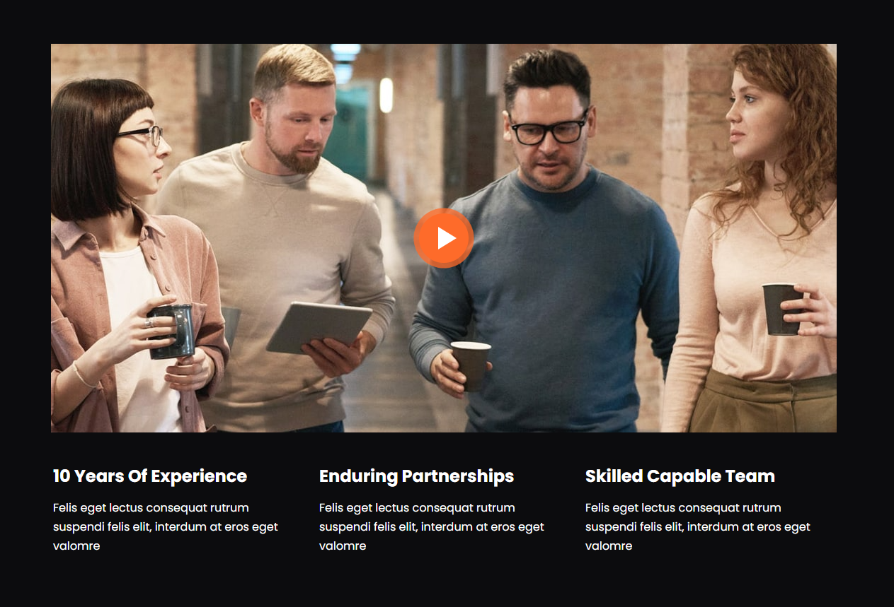

# Video Section & Modal

Now we want to add a section with a video image with an animated play button and when that button is clicked, it will open a modal and play a video. We will do the modal in the next lesson.

Let's start by adding the video section html. This will also include some horizontal cards/bullet points:

```html
<!-- Video -->
<section class="video my-6">
  <div class="container">
    <div class="row">
      <div class="col-lg-12 d-flex flex-column align-items-center">
        <div class="position-relative">
          
          <a
            class="video-btn"
            data-bs-toggle="modal"
            data-bs-target="#videoModal"
            data-bs-src="https://www.youtube.com/embed/u72H_zZzkcw"
          >
            <span class="video-play-button">
              <span></span>
            </span>
          </a>
        </div>
      </div>
    </div>
    <div class="video-points row px-6 mt-5">
      <div class="col-lg-4">
        <h4 class="fw-bold">10 Years Of Experience</h4>
        <p>
          With over 10 years of experience, we have gained valuable insights and
          expertise to deliver high-quality software solutions
        </p>
      </div>
      <div class="col-lg-4">
        <h4 class="fw-bold">Enduring Partnerships</h4>
        <p>
          We believe in building enduring partnerships with our clients. We
          establish long-term relationships based on trust
        </p>
      </div>
      <div class="col-lg-4">
        <h4 class="fw-bold">Skilled Capable Team</h4>
        <p>
          Our team consists of skilled and capable professionals who are
          passionate about delivering excellence
        </p>
      </div>
    </div>
  </div>
</section>
```

We added some custom data attributes to the `a` tag. We will use these in the next lesson to create the modal.

On small screens, I want to remove padding and align the text to center for the video points. So let's add this to our `styles.scss` file:

```scss
@media (max-width: 992px) {
  // ...

  .video-points {
    padding: 0 !important;
    text-align: center;
  }
}
```

## Animated Play Button

This is not something that we can do with Bootstrap. We need to add some custom CSS to show and animate the play button. Let's add this to our `styles.scss` file:

```scss
.video-play-button {
  position: absolute;
  z-index: 10;
  top: 50%;
  left: 50%;
  transform: translateX(-50%) translateY(-50%);
  width: 32px;
  height: 44px;
  border-radius: 50%;
  display: block;
  box-sizing: content-box;
  padding: 1.125rem 1.25rem 1.125rem 1.75rem;
  cursor: pointer;
}

.video-play-button:before {
  content: '';
  position: absolute;
  z-index: 0;
  top: 50%;
  left: 50%;
  transform: translateX(-50%) translateY(-50%);
  width: 76px;
  height: 76px;
  border-radius: 50%;
  display: block;
  background: #fe6b2a;
  animation: pulse-border 1500ms ease-out infinite;
}

.video-play-button:after {
  content: '';
  position: absolute;
  z-index: 1;
  top: 50%;
  left: 50%;
  transform: translateX(-50%) translateY(-50%);
  width: 70px;
  height: 70px;
  border-radius: 50%;
  display: block;
  background: #fe6b2a;
  transition: all 200ms;
}

.video-play-button span {
  position: relative;
  display: block;
  z-index: 3;
  top: 6px;
  left: 4px;
  width: 0;
  height: 0;
  // Draw Play Icon
  border-left: 26px solid #ffffff;
  border-top: 16px solid transparent;
  border-bottom: 16px solid transparent;
}

@keyframes pulse-border {
  0% {
    transform: translateX(-50%) translateY(-50%) translateZ(0) scale(1);
    opacity: 1;
  }
  100% {
    transform: translateX(-50%) translateY(-50%) translateZ(0) scale(1.5);
    opacity: 0;
  }
}
```

We are using the `::before` and `::after` pseudo-elements to create the circle around the play button and then we are using the `::after` pseudo-element to create the play button itself. We are also using the `@keyframes` to create the animation.

The span is used to create the play icon. We are using the `border` property to create the triangle.

You should see something like this:



In the next lesson, we will add the modal.
