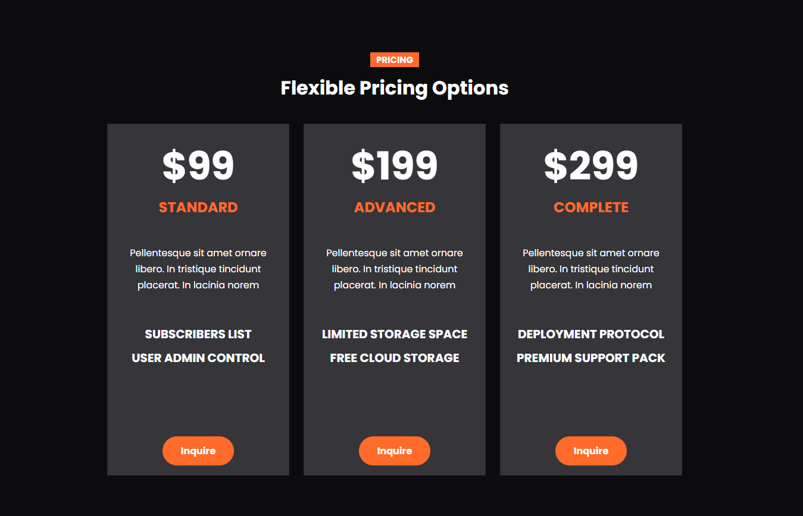
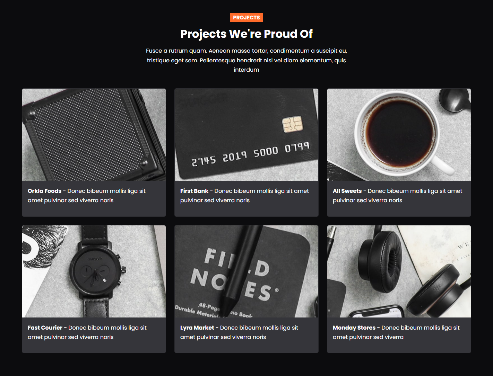

# Pricing & Projects

Now we will add the pricing and project card sections.

## Pricing

We will have 3 cards with some info. Let's add this to our `index.html` file:

```html
<!-- Pricing -->
<section id="pricing" class="pricing my-6">
  <div class="container">
    <!-- Heading -->
    <div class="row mb-4">
      <div
        class="col-md-6 offset-md-3 d-flex flex-column align-items-center text-center"
      >
        <h5>
          <span class="badge bg-primary rounded-0 text-uppercase">Pricing</span>
        </h5>
        <h2 class="fw-bold">Flexible Pricing Options</h2>
      </div>
    </div>
    <div class="row justify-content-center">
      <!-- Pricing Col 1 -->
      <div class="col-md-3">
        <div class="card bg-secondary text-center rounded-0">
          <div class="card-body">
            <div class="text-xl fw-bold">$99</div>
            <h4 class="card-title text-primary text-uppercase fw-bold mb-5">
              Standard
            </h4>
            <p>
              Our standard pricing plan offers a comprehensive set of features
              for your software needs.
            </p>
            <ul class="list-unstyled lh-lg mt-5">
              <li class="media">
                <div class="text-uppercase fs-5">
                  <strong>subscribers List</strong>
                </div>
              </li>
              <li class="media">
                <div class="text-uppercase fs-5">
                  <strong>User Admin Control</strong>
                </div>
              </li>
            </ul>
            <a class="btn btn-primary text-white mt-6 fw-bold" href="#contact"
              >Inquire</a
            >
          </div>
        </div>
      </div>
      <!-- Pricing Col 2 -->
      <div class="col-md-3">
        <div class="card bg-secondary text-center rounded-0">
          <div class="card-body">
            <div class="text-xl fw-bold">$199</div>
            <h4 class="card-title text-primary text-uppercase fw-bold mb-5">
              Advanced
            </h4>
            <p>
              Unlock additional enhanced capabilities. Take your software
              solutions to the next level.
            </p>
            <ul class="list-unstyled lh-lg mt-5">
              <li class="media">
                <div class="text-uppercase fs-5">
                  <strong>Limited Storage Space</strong>
                </div>
              </li>
              <li class="media">
                <div class="text-uppercase fs-5">
                  <strong>Free Cloud Storage</strong>
                </div>
              </li>
            </ul>
            <a class="btn btn-primary text-white mt-6 fw-bold" href="#contact"
              >Inquire</a
            >
          </div>
        </div>
      </div>
      <!-- Pricing Col 3 -->
      <div class="col-md-3">
        <div class="card bg-secondary text-center rounded-0">
          <div class="card-body">
            <div class="text-xl fw-bold">$299</div>
            <h4 class="card-title text-primary text-uppercase fw-bold mb-5">
              Complete
            </h4>
            <p>
              Our complete pricing plan offers an all-inclusive package with
              advanced features
            </p>
            <ul class="list-unstyled lh-lg mt-5">
              <li class="media">
                <div class="text-uppercase fs-5">
                  <strong>Deployment Protocol</strong>
                </div>
              </li>
              <li class="media">
                <div class="text-uppercase fs-5">
                  <strong>Premium Support Pack</strong>
                </div>
              </li>
            </ul>
            <a class="btn btn-primary text-white mt-6 fw-bold" href="#contact"
              >Inquire</a
            >
          </div>
        </div>
      </div>
    </div>
  </div>
</section>
```

We only have 3 cards, but I wanted them to be thinner than if we used `col-md-4`. So I used `col-md-3` and then added the class of `justify-content-center` to the row to center them.

Pricing looks like this:



## Projects

The projects will consist of 2 rows of three columns. We are going to have these cards open up a modal when clicked, but we will add the modals in the next video. For now, let's add the projects section to our `index.html` file:

```html
<!-- Projects -->
<section id="projects" class="projects my-6">
  <div class="container">
    <!-- Heading -->
    <div class="row mb-4">
      <div
        class="col-md-6 offset-md-3 d-flex flex-column align-items-center text-center"
      >
        <h5>
          <span class="badge bg-primary rounded-0 text-uppercase"
            >Projects</span
          >
        </h5>
        <h2 class="fw-bold">Projects We're Proud Of</h2>
        <p>
          We take pride in our successful projects and the value they bring to
          our clients. With our expertise and dedication, we have delivered
          exceptional results. Here are some highlights:
        </p>
      </div>
    </div>
    <!-- Project Row 1 -->
    <div class="row">
      <!-- Project 1 -->
      <div class="col-md-4 mb-4">
        <div class="card bg-secondary">
          <a data-bs-toggle="modal" data-bs-target="#modal1">
            
            <div class="card-body">
              <p>
                <strong>Orkla Foods</strong> - Donec bibeum mollis liga sit amet
                pulvinar sed viverra noris
              </p>
            </div>
          </a>
        </div>
      </div>
      <!-- Project 2 -->
      <div class="col-md-4 mb-4">
        <div class="card bg-secondary">
          <a data-bs-toggle="modal" data-bs-target="#modal2">
            
            <div class="card-body">
              <p>
                <strong>First Bank</strong> - Donec bibeum mollis liga sit amet
                pulvinar sed viverra noris
              </p>
            </div>
          </a>
        </div>
      </div>
      <!-- Project 3 -->
      <div class="col-md-4 mb-4">
        <div class="card bg-secondary">
          <a data-bs-toggle="modal" data-bs-target="#modal3">
            
            <div class="card-body">
              <p>
                <strong>All Sweets</strong> - Donec bibeum mollis liga sit amet
                pulvinar sed viverra noris
              </p>
            </div>
          </a>
        </div>
      </div>
    </div>
    <!-- Project Row 2 -->
    <div class="row">
      <!-- Project 4 -->
      <div class="col-md-4 mb-4">
        <div class="card bg-secondary">
          <a data-bs-toggle="modal" data-bs-target="#modal4">
            
            <div class="card-body">
              <p>
                <strong>Fast Courier</strong> - Donec bibeum mollis liga sit
                amet pulvinar sed viverra noris
              </p>
            </div>
          </a>
        </div>
      </div>
      <!-- Project 5 -->
      <div class="col-md-4 mb-4">
        <div class="card bg-secondary">
          <a data-bs-toggle="modal" data-bs-target="#modal5">
            
            <div class="card-body">
              <p>
                <strong>Lyra Market</strong> - Donec bibeum mollis liga sit amet
                pulvinar sed viverra noris
              </p>
            </div>
          </a>
        </div>
      </div>
      <!-- Project 6 -->
      <div class="col-md-4 mb-4">
        <div class="card bg-secondary">
          <a data-bs-toggle="modal" data-bs-target="#modal6">
            
            <div class="card-body">
              <p>
                <strong>Monday Stores</strong> - Donec bibeum mollis liga sit
                amet pulvinar sed viverra
              </p>
            </div>
          </a>
        </div>
      </div>
    </div>
  </div>
</section>
```

We have an `a` tag linking to a modal for each one, but we will create the modals in the next video. I do want to have a simple hover effect on each project card. So add this to your `styles.css` file:

```css
.projects img:hover {
  opacity: 0.8;
  cursor: pointer;
}
```

Projects should look like this:


