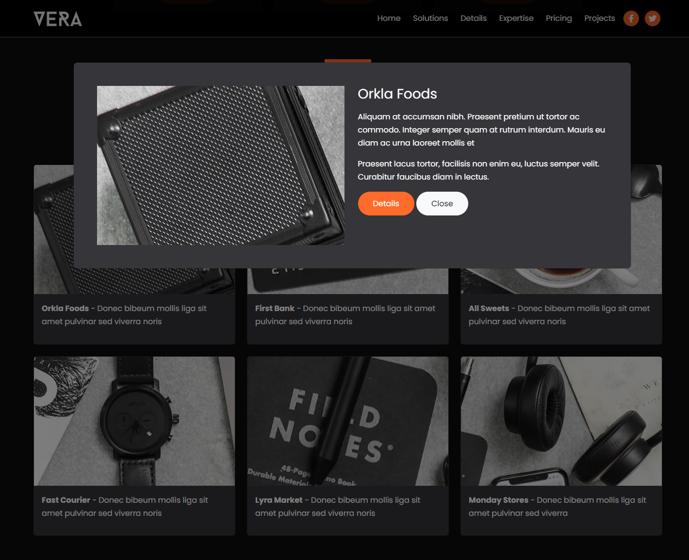

# Project Modals

We have our project cards, but we need to add modals for each one. We will create a modal for each project. Add the following code to your `index.html` file:

```html
<!-- Projects Modals -->
<div class="projects-modals">
  <!-- Modal 1 -->
  <div id="modal1" class="modal fade" tabindex="-1" aria-hidden="true">
    <div class="modal-dialog modal-lg mt-7">
      <div class="modal-content bg-secondary p-5">
        <div class="row">
          <div class="col-md-6">
            
          </div>
          <!-- end of col -->
          <div class="col-md-6">
            <h3>Orkla Foods</h3>
            <p>
              Aliquam at accumsan nibh. Praesent pretium ut tortor ac commodo.
              Integer semper quam at rutrum interdum. Mauris eu diam ac urna
              laoreet mollis et
            </p>
            <p>
              Praesent lacus tortor, facilisis non enim eu, luctus semper velit.
              Curabitur faucibus diam in lectus.
            </p>
            <a class="btn btn-primary text-white" href="#">Details</a>
            <button type="button" class="btn btn-light" data-bs-dismiss="modal">
              Close
            </button>
          </div>
        </div>
      </div>
    </div>
  </div>
  <!-- Modal 2 -->
  <div id="modal2" class="modal fade" tabindex="-1" aria-hidden="true">
    <div class="modal-dialog modal-lg mt-7">
      <div class="modal-content bg-secondary p-5">
        <div class="row">
          <div class="col-md-6">
            
          </div>
          <!-- end of col -->
          <div class="col-md-6">
            <h3>First Bank</h3>
            <p>
              Aliquam at accumsan nibh. Praesent pretium ut tortor ac commodo.
              Integer semper quam at rutrum interdum. Mauris eu diam ac urna
              laoreet mollis et
            </p>
            <p>
              Praesent lacus tortor, facilisis non enim eu, luctus semper velit.
              Curabitur faucibus diam in lectus.
            </p>
            <a class="btn btn-primary text-white" href="#">Details</a>
            <button type="button" class="btn btn-light" data-bs-dismiss="modal">
              Close
            </button>
          </div>
        </div>
      </div>
    </div>
  </div>
  <!-- Modal 3 -->
  <div id="modal3" class="modal fade" tabindex="-1" aria-hidden="true">
    <div class="modal-dialog modal-lg mt-7">
      <div class="modal-content bg-secondary p-5">
        <div class="row">
          <div class="col-md-6">
            
          </div>
          <!-- end of col -->
          <div class="col-md-6">
            <h3>All Sweets</h3>
            <p>
              Aliquam at accumsan nibh. Praesent pretium ut tortor ac commodo.
              Integer semper quam at rutrum interdum. Mauris eu diam ac urna
              laoreet mollis et
            </p>
            <p>
              Praesent lacus tortor, facilisis non enim eu, luctus semper velit.
              Curabitur faucibus diam in lectus.
            </p>
            <a class="btn btn-primary text-white" href="#">Details</a>
            <button type="button" class="btn btn-light" data-bs-dismiss="modal">
              Close
            </button>
          </div>
        </div>
      </div>
    </div>
  </div>
  <!-- Modal 4 -->
  <div id="modal4" class="modal fade" tabindex="-1" aria-hidden="true">
    <div class="modal-dialog modal-lg mt-7">
      <div class="modal-content bg-secondary p-5">
        <div class="row">
          <div class="col-md-6">
            
          </div>
          <!-- end of col -->
          <div class="col-md-6">
            <h3>Fast Courier</h3>
            <p>
              Aliquam at accumsan nibh. Praesent pretium ut tortor ac commodo.
              Integer semper quam at rutrum interdum. Mauris eu diam ac urna
              laoreet mollis et
            </p>
            <p>
              Praesent lacus tortor, facilisis non enim eu, luctus semper velit.
              Curabitur faucibus diam in lectus.
            </p>
            <a class="btn btn-primary text-white" href="#">Details</a>
            <button type="button" class="btn btn-light" data-bs-dismiss="modal">
              Close
            </button>
          </div>
        </div>
      </div>
    </div>
  </div>
  <!-- Modal 5 -->
  <div id="modal5" class="modal fade" tabindex="-1" aria-hidden="true">
    <div class="modal-dialog modal-lg mt-7">
      <div class="modal-content bg-secondary p-5">
        <div class="row">
          <div class="col-md-6">
            
          </div>
          <!-- end of col -->
          <div class="col-md-6">
            <h3>Lyra Market</h3>
            <p>
              Aliquam at accumsan nibh. Praesent pretium ut tortor ac commodo.
              Integer semper quam at rutrum interdum. Mauris eu diam ac urna
              laoreet mollis et
            </p>
            <p>
              Praesent lacus tortor, facilisis non enim eu, luctus semper velit.
              Curabitur faucibus diam in lectus.
            </p>
            <a class="btn btn-primary text-white" href="#">Details</a>
            <button type="button" class="btn btn-light" data-bs-dismiss="modal">
              Close
            </button>
          </div>
        </div>
      </div>
    </div>
  </div>
  <!-- Modal 6 -->
  <div id="modal6" class="modal fade" tabindex="-1" aria-hidden="true">
    <div class="modal-dialog modal-lg mt-7">
      <div class="modal-content bg-secondary p-5">
        <div class="row">
          <div class="col-md-6">
            
          </div>
          <!-- end of col -->
          <div class="col-md-6">
            <h3>Monday Stores</h3>
            <p>
              Aliquam at accumsan nibh. Praesent pretium ut tortor ac commodo.
              Integer semper quam at rutrum interdum. Mauris eu diam ac urna
              laoreet mollis et
            </p>
            <p>
              Praesent lacus tortor, facilisis non enim eu, luctus semper velit.
              Curabitur faucibus diam in lectus.
            </p>
            <a class="btn btn-primary text-white" href="#">Details</a>
            <button type="button" class="btn btn-light" data-bs-dismiss="modal">
              Close
            </button>
          </div>
        </div>
      </div>
    </div>
  </div>
</div>
```

Each modal will contain the image and some text about the project as well as a show details button, that won't do anything and a close button that will close the modal.

## Custom Styles

I just want the modal to be a bit wider and add some margin to the top, so add this to your `styles.css` file:

```css
.projects-modals .modal-dialog {
  max-width: 1150px;
  margin-top: 130px;
}
```

A modal will look like this:


